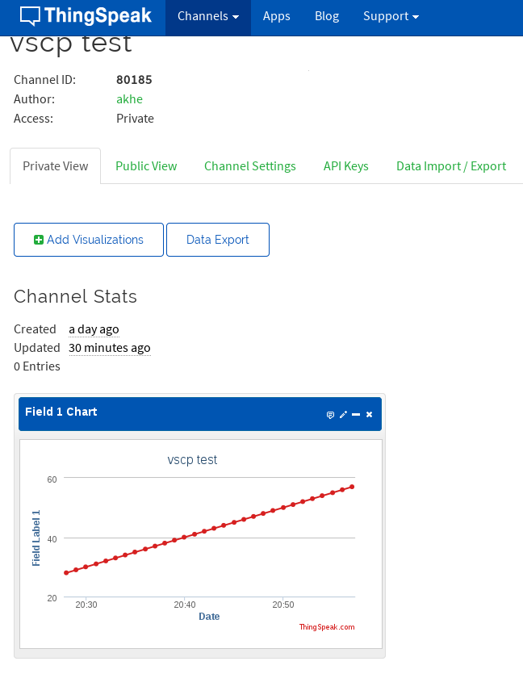
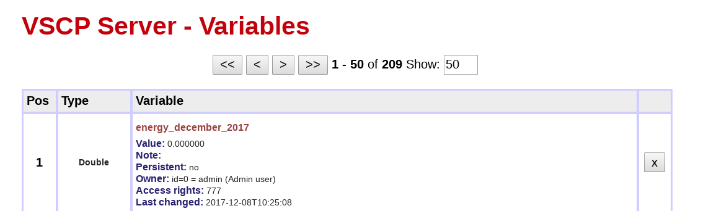

# VSCP Daemon Decision Matrix

The decision matrix of the VSCP daemon works much the same as a decision matrix on a low end node with the difference that it is much more capable. Events coming in through any of the interfaces of the VSCP daemon is all feed through the internal decision matrix, DM. There are also some events that are generated internally by the VSCP daemon ([CLASS2.VSCPD](http://www.vscp.org/docs/vscpspec/doku.php?id=class2.vscpd)) that is feed through the matrix.

A decision matrix (DM) row consist of a selection part which listen for specific programmed incoming events that will trigger an action which also have a parameter that defines how it should be performed. Action parameter are strings and can be of any length. There is also no limit in the number of DM rows available even if there naturally is a practical system limit.

On late releases of the VSCP daemon the DM is stored in a database on disk which is read into memory at start up. On older systems and as an option the matrix can also be loaded form an XML file. While the database is configured through the web interface the XML file can be configured using a simple text editor. 

It is still possible to load XML rows from a disk file also on newer systems and these rows can both be edited and deleted but not that they will be loaded again the next time the server is started. Only DM rows stored in the database is truly dynamic in it's nature in this respect.

## Decision matrix row elements/tags

### row

The **row** tag specify one DM entry. The **enabled** attribute, which can be "true" or "false" to enable or disable a row. The **groupid** attribute can be used to group several DM-rows together with a user specified string value.

### mask

The **mask** tag specify the mask for which part of an event that is of interest. Attributes are **priority**, **class**, **type** and **guid**. Bits of interest should be set to a one. So to compare the class set in filter set the corresponding mask to 0xffff or 65535 and so on. GUID should be on the form FF:FF:FF:FF:FF:FF:FF:FF:FF:FF:FF:FF:FF:FF:FF:FF, that is all numbers are in hexadecimal without the usual initial "0x".

Simplest way of looking on the mask is to set it to zero if the tag should not be compared or to the max value if not. Max values are

 | Tag           | Max value            | 
 | :---           | ---------            | 
 | **Priority**  | 0x0f/15              | 
 | **Class**     | 0xFFFF/65535         | 
 | **Type**      | 0xFFFF/65535         | 
 | **GUID byte** | FF (no initial "ox") | 

To trigger on a specific event. Set the mask for the class and the type both to 0xffff and the corresponding class/type of the filter to the event of interest. So in the sample below events of any priority and from any GUID will trigger if the class/type is the same as set in the filter.

```xml
<mask 
    priority="0" 
    class="0xFFFF" 
    type="0xFFFF" 
    guid="00:00:00:00:00:00:00:00:00:00:00:00:00:00:00:00">
</mask>
```

The sample below will not test priority,class, and the upper fifteen bytes of the GUID. But will test the LSB. So events of any priority and with any class/type but with the LSB if the GUID set to the value set in the corresponding GUID position of teh filter will trigger the DM action.

```xml
<mask 
    priority="0" 
    class="0" 
    type="0" 
    guid="00:00:00:00:00:00:00:00:00:00:00:00:00:00:00:FF">
</mask>
```


### Default

If mask/filter is omitted every event is accepted.

### filter

The **filter** tag specify the filter for which part of an event that is of interest. Attributes are **priority**, **class**, **type** and **guid**. Set the attribute to the value of interest and enable a test of it by setting the corresponding mask to all ones. For example to test for events with class=10 set the class attribute of the filter to 10 and the class attribute of the mask to 0xffff/65535. GUID should be on the form FF:FF:FF:FF:FF:FF:FF:FF:FF:FF:FF:FF:FF:FF:FF:FF, that is all numbers are in hexadecimal without the usual initial "0x".

The simple way to look at the mask/filter combination is to set a mask to zero if the corresponding filter part should not be compared and is a don't care. You can create more complex scenarios of course as explained below.

The filter is combined with the mask. First the incoming event is masked this means all bits where the mask is zero is also set to zero in the event. The result is compared to the filter, if they are the same we have a match and the decision matrix row is triggered. 

If you set the mask for a row to all ones and the filter equal to the event you are interested in, then that row will be triggered when that event is received by the daemon. In this case you can have the mask for priority, GUID set to zero so that events with all priorities and from all units (with different GUID's) will trigger the row. If you only are interested in events from a specific node set the GUID part of the mask to ones (FF:FF:FF:FF:FF:FF:FF:FF:FF:FF:FF:FF:FF:FF:FF:FF) and the GUID part for the filter to the node's GUID.

Another way one can use to match a single event is to set both filter and mask to the same value. This will have the same effect as the above method. Just remember that the mask should have a zero in a bit position for a don't care and a one for a significant bit and the filter should have the corresponding bit set to the value that is wanted and all other bits set to zero.

The truth table for all this looks like this:


 | filter \^ event-bit | mask | result | 
 | :---------------: | :-------------------: | :----: | ------ | 
 | 0               | 0                   | 1    |       
 | 0               | 1                   | 1    |       
 | 1               | 0                   | 1    |       
 | 1               | 1                   | 0    |       

### Default

If mask/filter is omitted every event is accepted.


### control

**Deprecated** from version 1.12.11.0

This is the 32-bit DM control word.  

 | Bit | Description    | 
 | :---: | -----------  | 
 | 31  | Reserved.      | 
 | 30  | This bit can be used to disable all decision  matrix entries below the row that has this bit set. | 
 | 5   | Specifies that the index should be checked. | 
 | 4   | Specifies that the zone should be checked.   | 
 | 3   | Specifies that the sub-zone should be checked. | 


### index

**Index** is in the first data byte for events that support it. If  specified a check will be done to check if the value set here is equal to the first byte of the incoming events data. 

If **measurementindex** attribute is set to *true* the measurement index will be checked instead of the event index. Measurement events (for example [CLASS1.MEASUREMENT events](https://grodansparadis.gitbooks.io/the-vscp-specification/class1.measurement.html)) usually have an index that identify a specific sensor (0-7 or 0-255). A check will be done to check if the measurement index of the incoming event have a value equal to the one set here. 

### zone

If the **bEnable** attribute is set to *true* a check will be done to check if the value set here is equal to the second byte of the incoming events data. 

### subzone

If the **bEnable** attribute is set to *true* a check will be done to check if the value set here is equal to the third byte of the incoming events data.

### allowed_from

This is the ISO date time from which the DM action can happen. The format is a standard ISO date/time on the form YYYY-MM-DD HH:MM:SS or YYYY-MM-DDTHH:MM:SS.

You can omit this tag or set it to '*' which means from beginning of time.

### allowed_to

This is the ISO date time up to which the DM action can happen. The format is a standard ISO date/time on the form YYYY-MM-DD HH:MM:SS or YYYY-MM-DDTHH:MM:SS.

You can omit this tag or set it to '*' which means to end of time.

### allowed_weekdays

This is a string with seven entries each representing a day of the week. If a DM action is allowed to occur every day of a week the string should be given as "mtwtfss" or '*'. Use a dash for a day which the action is not allowed to occur. For example if the DM action can occur on all days except Wednesdays use the string "mt-tfss".

### allowed_time

This is a string that tells at which time(s) a DM event is allowed to occur at. The string has the form 

    YYYY-MM-DD HH:MM:SS    

You can set any of the items to a * meaning any time so

	
	  *-*-* *:*:*


is any time. You can also use a slash to give a list of times. So

	
	  *-*-* *:0/5/10:0


will trigger the DM action every hour, five minutes over the hour and ten minutes over the hour, every day, every month, every year. On the other hand

	
	  *-1/6-* *:0/5/10:0


will just do the same in January and in June.

You can omit this tag or set it to '*' which means always.

### measurement

*Added in version 1.12.11.0*

This makes it possible to compare a measurement value for measurement events (for example [CLASS1.MEASUREMENT events](https://grodansparadis.gitbooks.io/the-vscp-specification/class1.measurement.html)) with a pre-set value defined here. 

Format is

```xml	
<measurement compare="noop|eq|neq|gt|gteq|lt|lteq" 
                unit="0" 
	            value="78.2" />
```

where the comparison value is represented by "78.2" here and unit is set to the default value zero.

The attribute **compare** defines which comparison that should be performed with the following possible values

 | Comparison | Alternative | Internal code | Description | 
 | :----------: | :-----------: | :-------------: | ----------- | 
 | **noop** | empty | 0 | No comparison. **Default**  | 
 | **eq**   | **==** | 1 | Check for equal. | 
 | **neq**  | **!=** | 2 | Check for NOT equal. | 
 | **gt**   | **>**  | 3 | Check for greater than. | 
 | **gteq** or **eqgt** | **>=** | 4 | Check for greater than or equal. | 
 | **lt**  | **<** | 5 | Check for less than. | 
 | **lteq** or **eqlt** | `<nowiki>``<=</nowiki>` | 6  | Check for less than or equal. | 

The attribute **unit** is a numerical code that specifies which unit the incoming value should have (0-3 for Level I/0-255 for Level II).

**Sensor index** for the sensor is set in the index tag with the attribute measurementindex set to true and is (0-7 for Level I/0-255 for Level II).   

### action

This is a 32-bit action code that specifies which action should be executed if the row is triggered. Actions and their codes are described [here](./decision_matrix.md#actions).

### param

The parameter is a text string that makes it possible to control how the action is performed. Before the action is performed the string is checked for escapes and this makes it possible to pass run time information in an easy way. Escapes are defined [here](./decision_matrix.md#variable_substitution_for_parameters).

### comment

Make your own comments of what the row is there for here.

## The decision matrix XML file

**Note!** *The XML file format is deprecated and replaced by a database which is edited in the web interface. It is however still possible to read DM entries from the XML file but the rows that is read from a disk file can not be edited and saved.* 

When the daemon is started up the internal decision matrix is loaded from the dm.xml in the folder set as configuration path. 

The dm.xml file can be edited but easier is to use the web interface of the VSCP daemon to updated and add entries. The location is 

    http://localhost:8884/vscp/dm
    
if VSCP daemon is on a local host.  

The format for the dm.xml file is as follows

```xml
<?xml version = "1.0" encoding = "UTF-8" ?>

<!-- This files holds the decision matrix for the daemon  -->

<dm>    
    <!-- Enabled row, belongs to group "test" -->
    <row enabled="true" groupid="test">

        <!-- Mask to trigger row -->
        <mask priority="1"
                class="0xFFFF"
                type="55"
                guid="0F:0E:0D:0C:0B:0A:09:08:07:06:05:04:03:02:01:00">
        </mask>

        <!-- Filter to trigger row -->
        <filter priority="7" 
                    class="1000" 
                    type="0xAA" 
                    guid="FF:EE:DD:CC:BB:AA:99:88:77:66:55:44:33:22:11:00">
        </filter>
	
        <!-- Date and time from which action should trigger -->    
        <allowed_from>1970-01-01 00:00:00</allowed_from> 
		
        <!-- Date and time up to which action should trigger --> 
        <allowed_to>2099-12-31 23:59:59</allowed_to>
	
        <!-- List of weekdays which action should trigger -->   
        <allowed_weekdays>mtwtfss</allowed_weekdays>        
		
        <!-- A specific time (or pattern) when the action should trigger -->
        <!-- Here every zero,five and ten minutes-->
        <allowed_time>-*-* *:0/5/10:0</allowed_time> 
    
        <!-- Optional - Set Index to check -->
        <!-- if measurementindex is true the measurement index is -->
        <!-- checked instead of the event index (byte 0). -->
        <index measurementindex="true|false">`0</index>

        <!-- Optional - Set Zone to check -->
        <zone>0</zone>

        <!-- Optional - Set Subzone to check -->
        <subzone>0</subzone>

        <!-- measurement -->
        <measurement bEnable="true|false" compare="eq|neq|gt|gteq|lt|lteq" unit="0">78.2</measurement>

        <!-- Action code -->
        <action>0x10</action>
	
        <!-- Action parameter -->
        <param>1,t44;canal;12;25;abc;90</param>
	
        <!-- Comment for decion matrix row -->
        <comment>This is a dumb comment</comment>

    </row>    

</dm>
```

## Timing parameter data format


*  String with days the action can occur in as mtwtfss use '-' for day when action should not be performed. Can be Left empty or set to '*' for all days. Can also be empty or be left out which also means all days.

*  Start Data/time for when the action can occur in ISO format as YYYY-MM-DD HH:MM:SS Use a '*'  for beginning of type. Can also be empty or be left out which also means beginning of time.

*  End Data/time for when the action can occur in ISO format as YYYY-MM-DD HH:MM:SS Use a '*' for end of time. Can also be empty or be left out which also means end of time.

*  Action date/time when action should occur in ISO format as YYYY:MM:DD HH:MM:SS. Use '*' for always. Can also be empty or be left out which also means always.

The start and the end Date/time fields set the date/time range when the action is allowed to occur.

The action date set the date/time when the action should occur. This can be a one shot in which case the full date/time is filled in as in 2009-11-02 14:30:00 which will perform action at this time once if the start/end dates allow for that. To get repeats it is possible to use wild-cards. For example *-*-* 14:30:* (can also be written as * 14:30:*) will perform the operation every seconds from 14:30 to (but not including) 14:31 in the time range set by the start/end date/time range.

For repeating operation that is just dependent on time filter on the SECOND event so that this is the only event that trigger the row.

It is also possible to specify more then one of each element in the date/time by separating them with a slash. For example * 14:0/10/20/30/40/50:00 will do the action every ten minutes between two a clock and three a clock in the afternoon. 

## Scheduler

Each event that is received by the daemon is feed through the decision matrix. When the event is received it is placed on the DM input queue after passing an initial set of filter that removes events that are of no interest to the specific implementation. 

The first event in the DM queue is then run through the matrix and each DM row is compared and if there is a match the action for that row is executed. 

The daemon itself place some events on the DM queue. See Internal DM events below. For example the internal LOOP event is run through the matrix between every external event feed to the queue. The LOOP event will also be seen in the matrix when no other events are present. In this case a configuration value is used to set the time between two LOOP events (sleep time) if no other events arrive. 

## Variable substitution for parameters (escapes)

Action parameters are strings that are passed to actions and in that way can be used to configure the action to solve different problems. The action string can contain escape values which are replaced with real values before the action is performed. The following escapes are currently defined. 

 | Escape sequence | Description | 
 | :--------------- | ----------- | 
 | **%%** | The character `%` | 
 | **%;** | The character ';'. Semicolon is normally used to separates arguments of an action. | 
 | **%cr** | A carriage return. | 
 | **%lf** | A line feed. | 
 | **%crlf** | A carriage return + a line feed. | 
 | **%tab** | A tab. | 
 | **%bell** | A bell. | 
 | **%amp** | Insert an ampersand ('&') character | 
 | **%amp-html** | Insert HTML representation of ampersand (&amp;). | 
 | **%lt** | Insert a less than character. | 
 | **%lt-html** | Insert HTML representation of less than (&lt;). | 
 | **%gt** | Insert a greater than character. | 
 | **%gt-html** | Insert HTML representation of greater than (&gt;). | 
 | **%variable:[**//variable_name//**]**  | Value of a variable. BASE64 data **is not** decoded. | 
 | **%vardecode:[**//variable_name//**]** | Value of a variable. BASE64 data **is** decoded. | 
 | **%file:[**//path//**]** | Content of a named file. | 
 | **%event** | A full event in the standard text form. | 
 | **%event.class** | The class for the event as a number. | 
 | **%event.class.str** | The class for the event as a a descriptive string. | 
 | **%event.type** | The type for the event as a number. | 
 | **%event.type.str** | The type for the event as a a descriptive string. | 
 | **%event.head** | head of the event. | 
 | **%event.priority** | The priority for the event (from head). | 
 | **%event.sizedata** | The number of databytes the event have. | 
 | **%event.data**   | All data-bytes as a comma separated list. If no data 'empty' is set. | 
 | **%event.data[n]**    | Data byte n. If no data 'empty' is set. | 
 | **%event.hexdata[n]** | Data byte n in hex. If no data 'empty' is set. | 
 | **%event.data.bit[n]** | print the value of a bit. Bits are counted from left to right. That is bit=9 is bit 7 in byte 1 of the data. | 
 | **%event.bool[n]** | Boolean value for byte n printed as "true" or "false". | 
 | **%event.data.int8[n]** | Data byte n as a signed int8_t. | 
 | **%event.data.uint8[n]** | Data byte n as an unsigned uint8_t | 
 | **%event.hexdata.uint8[n]** | Data byte n is printed in hex. | 
 | **%event.data.int16[n]** | Data byte n/n+1 printed as a signed int16_t | 
 | **%event.data.uint16_t[n]** | Data byte n/n+1 printed out as an unsigned uint16_t. | 
 | **%event.hexdata.uint16_t[n]** | Data byte n/n+1 printed out as a hex uint16_t. | 
 | **%event.data.int32[n]**| Data byte n/n+1/n+2/n+3 printed out as a signed int32_t. | 
 | **%event.data.uint32[n]** | Data byte n/n+1/n+2/n+3 printed out as an unsigned uint32_t. | 
 | **%event.hexdata.uint32[n]** | Data byte n/n+1/n+2/n+3 printed out as an unsigned uint32_t. | 
 | **%event.data.float[n]** | Data byte n/n+1/n+2/n+3 as a floating point value. | 
 | **%event.data.double[n]** | Data byte n/n+1/n+2/n+3/n+4/n+5/n+6/n+7 as a double precision floating point value. | 
 | **%event.obid** | obid of event. | 
 | **%event.hardcoded** | Hardcoded bit f head as 0/1. | 
 | **%event.guid** | GUID of the event. | 
 | **%event.nickname** | nickname for the GUID of the event (LSB of GUID). | 
 | **%event.timestamp** | Timestamp of the event. | 
 | **%event.index** | This is the same as %event.data[0]. | 
 | **%event.zone** | This is the same as %event.data[1]. | 
 | **%event.subzone** | This is the same as %event.data[2]. | 
 | **%isodate** | Date in ISO format YY-MM-DD | 
 | **%isotime** | Time in ISO form HH:MM:SS. | 
 | **%isoboth** | Date + Time in ISO form YY-MM-DDTHH:MM:SS. | 
 | **%isobothms** | Date + Time + milliseconds in ISO form YY-MM-DDTHH:MM:SS.nnn. | 
 | **%unixtime** | Unix time as a 32-bit unsigned number. | 
 | **%mstime** | Current time in milliseconds. | 
 | * %hour** | Current hour. | 
 | **%minute** | Current minute. | 
 | **%second** | Current second. | 
 | **%week0**  | Current week number (1-52(53)). Week starts with Sunday. | 
 | **%week1** | Current week number (1-52(53)). Week starts with Monday. | 
 | **%weektxt** | Get week name in textual short form. | 
 | **%weektxtfull** | Get week name in textual long form. | 
 | **%month** | Current month number (1-12). | 
 | **%monthtxt** | Get current month in textual short form. | 
 | **%monthtxtfull ** | Get current month in textual long form. | 
 | **%year** | Current year. | 
 | **%quarter** | Current quarter(1-4). | 
 | **%path.config** | Return the directory containing the system config files. **Unix:** */etc* **Windows:** *C:\Documents and Settings\All Users\Application Data* **Mac:** */Library/Preferences*  | 
 | **%path.datadir** | Return the location of the applications global, i.e. not user-specific, data files. Unix: prefix/share/appname Windows: the directory where the executable file is located Mac: appname.app/Contents/SharedSupport bundle subdirectory | 
 | **%path.documentsdir** | Return the directory containing the current user's (the account the daemon/server is run as) documents. Unix: ~ (the home directory) Windows: C:\Documents and Settings\username\Documents Mac: ~/Documents | 
 | **%path.executable** | Return the directory and the filename for the current executable. Unix: /usr/local/bin/exename Windows: C:\Programs\AppFolder\exename.exe Mac: /Programs/exename | 
 | **%path.localdatadir**| Return the location for application data files which are host-specific and can't, or shouldn't, be shared with the other machines. | 
 | **%path.pluginsdir** | Return the directory where the loadable modules (plugins) live. Unix: prefix/lib/appname Windows: the directory of the executable file Mac: appname.app/Contents/PlugIns bundle subdirectory. | 
 | **%path.resourcedir** | Return the directory where the application resource files are located. The resources are the auxiliary data files needed for the application to run and include, for example, image and sound files it might use. Unix: prefix/share/appname Windows: the directory where the executable file is located Mac: appname.app/Contents/Resources bundle subdirectory. | 
 | **%path.tempdir** | Return the directory for storing temporary files. | 
 | **%path_userconfigdir** | Return the directory for the user config files. Unix: ~ (the home directory) Windows: C:\Documents and Settings\username\Application Data Mac: ~/Library/Preferences | 
 | **%path.userdatadir** | Return the directory for the user-dependent application data files: Unix: ~/.appname Windows: C:\Documents and Settings\username\Application Data\appname Mac: ~/Library/Application Support/appname | 
 | **%path.localdatadir** | Return the directory for user data files which shouldn't be shared with the other machines. | 
 | **%toliveafter1** | Inserts *'Carpe diem quam minimum credula postero.'*  | 
 | **%toliveafter2** | Inserts *'Be Hungry - Stay Foolish.'* | 
 | **%toliveafter3** | Inserts *'Stay Foolish - Be Hungry.'* | 
 | **%measurement.index** | Index from measurement data coding (0-7). | 
 | **%measurement.unit** | Unit from measurement data coding (0-3). | 
 | **%measurement.coding** | Index from measurement data coding (0-7). | 
 | **%measurement.float** | Convert event data to a floating point value. The class must be one of the measurement classes VSCP_CLASS1_MEASUREMENT, VSCP_CLASS2_LEVEL1_MEASUREMENT, VSCP_CLASS1_MEASUREZONE, VSCP_CLASS1_SETVALUEZONE, VSCP_CLASS1_MEASUREMENT64 or VSCP_CLASS2_MEASUREMENT_STR | 
 | **%measurement.string** | Convert event data to a string. The class must be one of the measurement classes VSCP_CLASS1_MEASUREMENT, VSCP_CLASS2_LEVEL1_MEASUREMENT, VSCP_CLASS1_MEASUREZONE, VSCP_CLASS1_SETVALUEZONE, VSCP_CLASS1_MEASUREMENT64 or VSCP_CLASS2_MEASUREMENT_STR | 
 | **%measurement.convert.data** | This converts a level I measurement from any of the measurement classes into string data in the form needed by the action send event. You can use it to always send a VSCP_CLASS2_MEASUREMENT event, that is easy to interpret, when a measurement event of any kind is received. Just add index,zone,subzone,%measurement.unit,%measurement.convert.data instead of the data for the event. The class should always be VSCP_CLASS2_MEASUREMENT_STR and the type %event.type | 
 | **%eventdata.realtext** | Tries to convert the event data into a string in a human readable format. | 

Can perfectly be used as arguments for triggered external program execution.  

## Actions

Actions can have long argument lists. If you are an end user don't be scared by this. The setup of DM rows is done with program support and you fill in the values in a nice GUI.

The semicolon character (`;`) is used as a separator for arguments and if needed in an argument `%;` should be used. Also the procent character (`%`) is a special character used for escapes and should be written as `%%`.

----

###  NOOP 

`VSCP_DAEMON_ACTION_CODE_NOOP    0x00/0`

No operation. 

----

### Execute external program

`VSCP_DAEMON_ACTION_CODE_EXECUTE    0x10/16`

Run an external program. The daemon must have execute access rights to be able to launch the program. It is important that this program returns as fast as possible. If lengthy operations is needed please fork another process in your external program and then return.

It is also important that you give the full path to the program and where used, it's extension. So instead of writing an executable as "mysql" your should write "C:\mysql-5.6.21-winx64\bin\mysql.exe". The reason for this is that the VSCP daemon checks if the file is available before trying to execute it.

##### Parameters


*  Full path to program + arguments to program. ( possibly with with substitution elements %event.class %event.type %date etc). 

*  Optional variable that is set to true if the execution was successful.

Note that the semicolon symbol (`;`) is used internally and if it is part of a program argument `%;` should be written. 

**Example 1**
Run a scripts when a CLASS1.MEASUREMENT, Type=6, Temperature event is received from a node with nodeid=1 and from sensor with index equal to 2 on that device.

```xml
<row enable="true" groupid="" >
    <mask  priority="0"  class="65535"  type="65535"  
        GUID=" 00:00:00:00:00:00:00:00:00:00:00:00:00:00:00:FF" > 
    </mask>
    <filter  priority="0"  class="10"  type="6"  
        GUID=" 00:00:00:00:00:00:00:00:00:00:00:00:00:00:00:01" > 
    </filter>
    <action>0x10</action>
    <param>/srv/vscp/thingspeak.sh XXXXXXXXXXXXXXXX %measurement.string</param>
    <comment>Send value for compressor sensor</comment>
    <allowed_from>0000-01-01 00:00:00</allowed_from>
    <allowed_to>9999-12-31 23:59:59</allowed_to>
    <allowed_weekdays>mtwtfss</allowed_weekdays>
    <allowed_time>-*-* *:*:</allowed_time>
    <index bMeasurement="true" >2</index>
</row>
```

**Example 2**

Turn on lights when the sun goes down (calculated).

```xml
<row enable="true" groupid="Tellstick" >
    <mask  priority="0"  class="65535"  type="65535"  
         GUID=" 00:00:00:00:00:00:00:00:00:00:00:00:00:00:00:00" > 
    </mask>
    <filter  priority="0"  class="20"  type="45"  
         GUID=" 00:00:00:00:00:00:00:00:00:00:00:00:00:00:00:00" > 
    </filter>
    <action>0x10</action>
    <param>/usr/local/bin/tdtool --on 1</param>
    <comment>Turn on window ligts when sun goes down</comment>
    <allowed_from>0000-01-01 00:00:00</allowed_from>
    <allowed_to>9999-12-31 23:59:59</allowed_to>
    <allowed_weekdays>mtwtfss</allowed_weekdays>
    <allowed_time>-*-* *:*:</allowed_time>
</row>
```

**Example 3**
Log data to a MySQL/MariaDB database

```xml
<row enable="true" groupid="" >
    <mask  priority="0"  class="65535"  type="65535"  
        GUID=" 00:00:00:00:00:00:00:00:00:00:00:00:00:00:00:FF" > 
    </mask>
    <filter  priority="0"  class="10"  type="6"  
        GUID=" 00:00:00:00:00:00:00:00:00:00:00:00:00:00:00:01" > 
    </filter>
    <action>0x10</action>
    <param>
     mysql -u'user' -p'password' -h'host' -e"INSERT 
       INTO temperature(GUID,SensorIndex,Date,Value) 
       VALUES ('%event.guid',%measurement.index,'%isodate %isotime', 
       %measurement.float)";
    </param>
    <comment> </comment>
    <allowed_from>0000-01-01 00:00:00</allowed_from>
    <allowed_to>9999-12-31 23:59:59</allowed_to>
    <allowed_weekdays>mtwtfss</allowed_weekdays>
    <allowed_time>-*-* *:*:</allowed_time>
    <index bMeasurement="true" >1</index>
</row>
```

**Example 4**

Start a new instance of gedit every minute at a specific date and time interval.

```xml
`<row enabled="true">

    <!-- Mask to trigger row - zero for a bit is don't care -->
    <mask priority="0" 
        class="0xFFFF" 
        type="0xFF" 
        guid="00:00:00:00:00:00:00:00:00:00:00:00:00:00:00:00">
    </mask>
    
    <!-- Filter to trigger row - 
          if mask have a one in a bit it is compared with filter -->
    <filter priority="7" 
            class="0xFFFF" 
            type="5" 
            guid="00:00:00:00:00:00:00:00:00:00:00:00:00:00:00:00">
    </filter>
	
    <!-- Date and time from which action should trigger -->
    <allowed_from>2020-01-01 00:00:00</allowed_from>     		

    <!-- Date and time up to which action should trigger -->
    <allowed_to>2020-01-01 05:59:59</allowed_to> 		

    <!-- Date and time up to which action should trigger -->
    <allowed_weekdays>mtwtfss</allowed_weekdays>
	
    <!-- A specific time (or pattern) when the action should trigger -->
    <!-- Every ten seconds-->
    <allowed_time>-*-* *:*:0</allowed_time>
		       			
    <!-- Action code  -->
    <action>0x10</action>          		

    <!-- Action parameter -->
    <param>
       /usr/bin/gedit
    </param>

    <!-- Comment for decision matrix row -->
    <comment>
       Start a new instance of gedit every minute at a
       specific date and time interval.
    </comment>

</row>
```

----

###  HTTP GET, POST, (PUT)

`VSCP_DAEMON_ACTION_CODE_GET_PUT_POST_URL    0x75/117`

This action access a given URL given by the action parameter. Can be used to write data to a remote data source using web server scripts or similar.

##### Action parameters

`method;url[;data;headers;proxy]`


*  Method: 'GET' (default), 'POST' (or 'put', 'options', 'delete', 'patch')

*  URL (e.g. http://www.host.com)

*  Optional data. This data should be on the form *name=Lucy&neighbours=Fred+%26+Ethel* and it is ignored if access method is 'get'

*  Optional extra header row(s). Each row must be ended with "\n".

*  Optional proxy on the form **\<hostname\>:\<port number\>** (just leave blank if no proxy should be used).

*put/options/delete/patch is not available at the moment.*

##### Note 1

Remember to us **%amp** instead of the ampersand character as it is invalid in XML file.

##### Note 2

Currently no login capabilities is available but you can use

    "http://`<user>`:`<password>`@mysite.com/mypath"

but should remember that this method is deprecated in RFC-1396  

##### Example 1

Use a HTTP POST to update a [Thingspeak](https://thingspeak.com) channel every minute. We use [CLASS2.VSCPD Type=6, MINUTE](https://grodansparadis.gitbooks.io/the-vscp-specification/class2.vscpd.html#type6) to update field1 which get the current minute value written using the escape **%minute**. The event is executed all time, every day, from beginning of time to the end of time.  

Replacing the current event with a measurement event and using %measurement.string instead of %minute for field1 is an easy way to get a dynamic diagram from measurement data.

The XML DM entry for this functionality looks like this. As always it is easier to use the web interface of the VSCP daemon to enter decision matrix rows.  

**"xxxxxxxxxxxxxxxx"** in the action parameter is the API key that one get from TingSpeak.

```xml
<row enable="true" groupid="" >
    <mask priority="0" class="65535"  type="65535"  
        GUID=" 00:00:00:00:00:00:00:00:00:00:00:00:00:00:00:00" > 
    </mask>
    <filter priority="0"  class="65535" type="6"  
        GUID=" 00:00:00:00:00:00:00:00:00:00:00:00:00:00:00:00" > 
    </filter>
    <action>0x75</action>
    <param>`POST;http://api.thingspeak.com/update;field1=%minute;X-THINGSPEAKAPIKEY: xxxxxxxxxxxxxxxx\n`</param>
    <comment>``</comment>`
    <allowed_from>0000-01-01 00:00:00</allowed_from>
    <allowed_to>9999-12-31 23:59:59</allowed_to>
    <allowed_weekdays>mtwtfss</allowed_weekdays>
    <allowed_time>-*-* *:*:</allowed_time>
    <index measurementindex="false">0</index>
    <zone>0</zone>
    <subzone>0</subzone>
    </row>
```

The result will be this



The format for updating several fields is

    field1=value&field2=value&field3=value...

As the ampersand is an invalid character in an XML file this has to be written as

    field1=value%ampfield2=value%ampfield3=value...

You can do the same using HTTP GET but the format is a bit different

```xml
<row enable="true" groupid="" >
    <mask  priority="0" class="65535" type="65535"  
        GUID="00:00:00:00:00:00:00:00:00:00:00:00:00:00:00:00" > 
    </mask>
    <filter priority="0" class="65535" type="6"  
        GUID="00:00:00:00:00:00:00:00:00:00:00:00:00:00:00:00" > 
    </filter>
    <action>0x75</action>
    <param>GET;http://api.thingspeak.com/update?key=xxxxxxxxxxxxxxxx%ampfield1=%minute</param>
    <comment> </comment>
    <allowed_from>0000-01-01 00:00:00</allowed_from>
    <allowed_to>9999-12-31 23:59:59</allowed_to>
    <allowed_weekdays>mtwtfss</allowed_weekdays>
    <allowed_time>-*-* *:*:</allowed_time>
    <index measurementindex="false" >0</index>
    <zone>0</zone>
    <subzone>0</subzone>
</row>
```


ThingSpeak API is described [here](https://community.thingspeak.com/documentation/api/)


----


###  Send event to remote VSCP server interface

`VSCP_DAEMON_ACTION_CODE_SEND_TO_REMOTE    0x43/67`

This action can be used to send an event to a remote VSCP daemon.

##### Parameters


*  Server address
*  Port
*  Username
*  Password
*  Event to send

Event has the same form as for the [send command](./tcp_ip_protocol_description.md#send_-_send_an_event) in the tcp/ip interface.

**example**

This example checks for a temperature event from sensor 1 of a remote node and send the event to another VSCP server. Note that by uncommenting the measurement tag the event can be checked for value also before sent.

Here the same event that triggers the action is used. One can of course send another event i one prefer, possibly one that is stored in a variable.

```xml
<row enable="true" groupid="send_remote_test" >

    <comment>
        Test action send event
    </comment>

    <mask priority="0"
             class="0xFFFF"
             type="0xFFFF"
             GUID=" 00:00:00:00:00:00:00:00:00:00:00:00:00:00:00:00" />

    <filter  priority="0"
             class="10"
             type="6"
             GUID=" 00:00:00:00:00:00:00:00:00:00:00:00:00:00:00:00" />

    <action>0x43</action>
    <param>
        192.168.1.6;9598;admin;secret;%event
    </param>

    <index measurementindex="true">1</index>

    <!-- eq|neq|gt|gteq|lt|lteq -->
    <!--
    <measurement compare="eq"
                   unit="1"
                   value="5.0"/>
   -->
</row>
```

----

###  Store in variable

`VSCP_DAEMON_ACTION_CODE_STORE_VARIABLE    0x50/80`

Store data in a variable. The variable is named in the argument. If the variable is not available it is created.

The data supplied in the action parameter in a named variable and one form that store the event in the variable. 

##### Parameters

    variable-name;variable-type;persistence;user;access-rights;value[;note]


*  Variable name.

*  Variable type (defaults to 1 = string ).

*  Persistence as true`<nowiki>`|`</nowiki>`false. (Defaults to false = non-persistent).

*  User (0 is admin).

*  Accessrights. 0x777 is all read/write/delete.

*  value in the form that type of variable expect. Must be BASE64 encoded for strings and other variable types that store it's data in BASE64 encoded form. You can add "BASE64:" before the string to accomplish this.

*  Variable description. Optional. Must be base64 encoded. You can add "BASE64:" before the string to accomplish this.

__Variable write__ formats is [here](./remote_variables.md#variable_types).

If the variable does not exist it is created. 

Note that there is possible to create dynamically created variables by using the escapes available. As an example a variable energy_%monthtxtfull_%year  In this case adding energy consumption for a month in a variable. 


**Example parameter data**

    Store in boolean: my_boolean;2;true;0;0x777;true
    Store in integer: my_int;int;true;0;0x777;24000 
    Store in string: my_string;string;true;0;0x777;"VGhpcyBpcyBhIHN0cmluZw==" 
    Store on event: my_event;7;false;0;0x777;0,20,1,2,3,4,5,6

**Stores string in variable when the VSCP server starts**

```xml
<row enable="true" groupid="Variables" >

    <comment>
        Test store in variable - The string variable is created
        when the server is started ( CLASS2.VSCPD, Type=23 ).
    </comment>

    <mask priority="0"  
          class="0xFFFF"  
          type="0xFFFF"  
          GUID=" 00:00:00:00:00:00:00:00:00:00:00:00:00:00:00:00" />

    <filter  priority="0"  
             class="65535"  
             type="23"  
             GUID=" 00:00:00:00:00:00:00:00:00:00:00:00:00:00:00:00" />

    <action>0x50</action>
    <param>
        test_variable_string;string;false;0;0x777;BASE64:Be Foolish, Be Hungry;BASE64:Test variable integer
    </param>

</row>
```

This is a same for a float

```xml
<row enable="true" groupid="Variables" >

    <comment>
        Test store in variable - The test_variable_float variable is created
        when the server is started ( CLASS2.VSCPD, Type=23 ).
    </comment>

    <mask priority="0"  
          class="0xFFFF"  
          type="0xFFFF"  
          GUID=" 00:00:00:00:00:00:00:00:00:00:00:00:00:00:00:00" />

    <filter priority="0"  
            class="65535"  
            type="23"  
            GUID=" 00:00:00:00:00:00:00:00:00:00:00:00:00:00:00:00" />

    <action>0x50</action>
    <param>
        test_variable_float;float;false;0;0x777;4333.56789;BASE64:Test variable float
    </param>

</row>
```xml

And a variable with a dynamic name

```xml
<row enable="true" groupid="Variables" >

    <comment>
        Test store in variable - The string variable is created
        when the server is started ( CLASS2.VSCPD, Type=23 ).
    </comment>

    <mask priority="0"  
          class="0xFFFF"  
          type="0xFFFF"  
          GUID=" 00:00:00:00:00:00:00:00:00:00:00:00:00:00:00:00" />

    <filter priority="0"  
            class="65535"  
            type="23"  
            GUID=" 00:00:00:00:00:00:00:00:00:00:00:00:00:00:00:00" />

    <action>0x50</action>
    <param>
        energy_%monthtxtfull_%year;float;false;0;0x777;0
    </param>

</row>
```



----

###  Add to a variable

`VSCP_DAEMON_ACTION_CODE_ADD_VARIABLE    0x52/82`

Add data to a variable. The variable is named in the argument.

##### Parameters

    variable-name;numerical-value-to-add

*  variable
*  Value to add to variable

**Example parameter**
    myvariable;1341

**Example**
The following two DM rows create a long variable when the VSCP servers starts and then add 5 to this variable each second.

```xml
<row enable="true" groupid="Variables" >

    <comment>`
        Test store in variable - The test_variable_float variable is created
        when the server is started ( CLASS2.VSCPD, Type=23 ).
    </comment>

    <mask priority="0"  
          class="0xFFFF"  
          type="0xFFFF"  
          GUID=" 00:00:00:00:00:00:00:00:00:00:00:00:00:00:00:00" />

    <filter priority="0"  
            class="65535"  
            type="23"  
            GUID=" 00:00:00:00:00:00:00:00:00:00:00:00:00:00:00:00" />

    <action>0x50</action>
    <param>
       test_variable_float;float;false;0;0x777;4333.56789;BASE64:Test variable float
    </param>
    
    
<row enable="true" groupid="Variables" >

    <comment>
        Add five to test_variable_float variable every second
        ( CLASS2.VSCPD, Type=5 ).
    </comment>

    <mask priority="0"  
          class="0xFFFF"  
          type="0xFFFF"  
          GUID=" 00:00:00:00:00:00:00:00:00:00:00:00:00:00:00:00" />

    <filter priority="0"  
            class="65535"  
            type="5"  
            GUID=" 00:00:00:00:00:00:00:00:00:00:00:00:00:00:00:00" />

    <action>0x52</action>
    <param>
        test_variable_float;5
    </param>

</row>

```

----

### Subtract from a variable 

`VSCP_DAEMON_ACTION_CODE_SUBTRACT_VARIABLE    0x53/83`

Subtract the data from a variable. The variable is named in the argument.

##### Parameters

    variable-name;numerical-value-to-subtract


*  Variable
*  Value to subtract from variable

**Example parameter**
    myvariable;10

**Example**

The following two DM rows create a long variable when the VSCP server starts and then one is subtracted from the created variable every second.

```xml
<row enable="true" groupid="Variables" >

    <comment>
        Test store in variable - The long variable is created
        when the server is started ( CLASS2.VSCPD, Type=23 ).
    </comment>

    <mask priority="0"  
          class="0xFFFF"  
          type="0xFFFF"  
          GUID=" 00:00:00:00:00:00:00:00:00:00:00:00:00:00:00:00" />

    <filter priority="0"  
            class="65535"  
            type="23"  
            GUID=" 00:00:00:00:00:00:00:00:00:00:00:00:00:00:00:00" />

    <actio>0x50</action>
    <param>`
        test_variable_long;long;false;0;0x777;0xffff;BASE64:Test variable long
    </param>

 </row>

 <row enable="true" groupid="Variables" >

    <comment>
         subtract from the test_variable_long variable every second
         ( CLASS2.VSCPD, Type=5 ).
    </comment>

    <mask priority="0"  
           class="0xFFFF"  
           type="0xFFFF"  
           GUID=" 00:00:00:00:00:00:00:00:00:00:00:00:00:00:00:00" />

    <filter priority="0"  
             class="65535"  
             type="5"  
             GUID=" 00:00:00:00:00:00:00:00:00:00:00:00:00:00:00:00" />

    <action>0x53</action>
    <param>
         test_variable_long;1
    </param>

</row>

```

----

### Multiply with a variable

`VSCP_DAEMON_ACTION_CODE_MULTIPLY_VARIABLE    0x54/84`

Multiply the data with a variable. The variable is named in the argument.

##### Parameters

    variable-name;numerical-value-to-multiply


*  Variable
*  Value to multiply variable with

**Example parameter**
    myvariable;3

**Example**

This example creates a long variable when the VSCP server starts up and then multiply this variable value with 2 every second.

```xml

<row enable="true" groupid="Variables" >

    <comment>
        Test store in variable - The long variable is created
        when the server is started ( CLASS2.VSCPD, Type=23 ).
    </comment>

    <mask priority="0"  
          class="0xFFFF"  
          type="0xFFFF"  
          GUID=" 00:00:00:00:00:00:00:00:00:00:00:00:00:00:00:00" />

    <filter priority="0"  
            class="65535"  
            type="23"  
            GUID=" 00:00:00:00:00:00:00:00:00:00:00:00:00:00:00:00" />

    <action>0x50</action>
    <param>
        test_variable_multiply;long;false;0;0x777;1;BASE64:Test variable long for multiply test
    </param>

</row>
       
   
<row enable="true" groupid="Variables" >

    <comment>
        Multiply test_variable_multiply variable with 2 every second
        ( CLASS2.VSCPD, Type=5 ).
    </comment>

    <mask priority="0"  
          class="0xFFFF"  
          type="0xFFFF"  
          GUID=" 00:00:00:00:00:00:00:00:00:00:00:00:00:00:00:00" />

    <filter priority="0"  
            class="65535"  
            type="5"  
            GUID=" 00:00:00:00:00:00:00:00:00:00:00:00:00:00:00:00" />

    <action>0x54</action>
    <param>
        test_variable_multiply;2
    </param>

</row>

```

----


### Divide the data with a variable

 
`VSCP_DAEMON_ACTION_CODE_DIVIDE_VARIABLE    0x55/85`

Divide the data with a variable. The variable is named in the argument.

##### Parameter

    variable-name;numerical-value-to-divide-with


*  variable
*  value to divide variable with

**Example parameter**
    myvariable;2

**Example**

This example creates a floating point variable when the VSCP servers starts up and then divide this value with 3 every second.

```xml

<row enable="true" groupid="Variables" >

    <comment>
        Test store in variable - The float variable is created
        when the server is started ( CLASS2.VSCPD, Type=23 ).
    </comment>

    <mask priority="0"  
        class="0xFFFF"  
        type="0xFFFF"  
        GUID=" 00:00:00:00:00:00:00:00:00:00:00:00:00:00:00:00" />

    <filter priority="0"  
            class="65535"  
            type="23"  
            GUID=" 00:00:00:00:00:00:00:00:00:00:00:00:00:00:00:00" />

    <action>`0x50`</action>
    <param>
        test_variable_divide;float;false;0;0x777;9999999999;BASE64:Test variable float for divide test
    </param>

</row>
       
   
<row enable="true" groupid="Variables" >

    <comment>
        Divide the test_variable_divide with 3 variable every second
        ( CLASS2.VSCPD, Type=5 ).
    </comment>

    <mask priority="0"  
          class="0xFFFF"  
          type="0xFFFF"  
          GUID=" 00:00:00:00:00:00:00:00:00:00:00:00:00:00:00:00" />

    <filter priority="0"  
            class="65535"  
            type="5"  
            GUID=" 00:00:00:00:00:00:00:00:00:00:00:00:00:00:00:00" />

    <action>0x55</action>
    <param>
        test_variable_divide;3
    </param>

</row>

```

----


### Check variable, set variable

`VSCP_DAEMON_ACTION_CODE_CHECK_VARIABLE    0x58/88`

Check if variable is greater than, equal to etc. than a specified value and set some other variable to the logic outcome of the compare. The variable is named in the argument. If the variable is not available it is created.

##### Parameters


*  Value to check.
*  Operation (see table below).
*  Variable to check.
*  Boolean variable which will have value set to logic outcome of the compare.

**Compare operators**

 | Operator     | Operator alternative | Description           | 
 | --------     | -------------------- | -----------           | 
 | noop         |                      | No operation          | 
 | lt           | <                    | Less than             | 
 | gt           | >                    | Greater then          | 
 | lteq or eqlt | <=                   | Less than or equal    | 
 | gteq or eqgt | >=                   | Greater than or equal | 
 | eq           | ==                   | Equal                 | 
 | neq          | !=                   | Not equal             | 

**Important!** Remember that the alternative notation must be escaped if used in XML 

**Example parameter data**

    500;gt;counter;flag
    
you can use escapes to of course. So comparing two variables
    
    %variable:[variable_name];gt;counter;flag

which will compare the value of *variable_name* with the value of *counter*.

----

### Check variable, set to true

`VSCP_DAEMON_ACTION_CODE_CHECK_VARIABLE_TRUE    0x56/86`

Check if variable is greater etc. then a specified value and set some other variable to true if it is. The variable is named in the argument. If the variable is not available it is created. 

##### Parameters


*  Value to check.
*  Operation (see table below).
*  Variable to check.
*  Boolean variable that will be set to true if the compare operation is true.

**Compare operators**

 | Operator     | Operator alternative | Description           | 
 | --------     | -------------------- | -----------           | 
 | noop         |                      | No operation          | 
 | lt           | <                    | Less than             | 
 | gt           | >                    | Greater then          | 
 | lteq or eqlt | <=                   | Less than or equal    | 
 | gteq or eqgt | >=                   | Greater than or equal | 
 | eq           | ==                   | Equal                 | 
 | neq          | !=                   | Not equal             | 

**Important!** Remember that the alternative notation must be escaped if used in XML 

**Example parameter data**

    500;gt;counter;flag

Will check if 500 is greater then counter and set the variable flag to true if it is.

----

### Check variable, set to false

`VSCP_DAEMON_ACTION_CODE_CHECK_VARIABLE_FALSE    0x57/87`

Check if variable is greater etc. then a specified value and set some other variable to false if it is. The variable is named in the argument. If the variable is not available it is created. 

#####  Parameters


*  Value to check.
*  Operation.
*  Variable to check.
*  Boolean variable that will be set to false if the compare operation is true.

**Compare operators**

 | Operator     | Operator alternative | Description           | 
 | --------     | -------------------- | -----------           | 
 | noop         |                      | No operation          | 
 | lt           | <                    | Less than             | 
 | gt           | >                    | Greater than          | 
 | lteq or eqlt | <=                   | Less than or equal    | 
 | gteq or eqgt | >=                   | Greater than or equal | 
 | eq           | ==                   | Equal                 | 
 | neq          | !=                   | Not equal             | 

**Important!** Remember that the alternative notation must be escaped if used in XML 

**Example parameter data**

    500;gt;counter;flag

Will check if 500 is greater then counter and set the variable flag to false if it is.

----

### Check Measurement

`VSCP_DAEMON_ACTION_CODE_CHECK_MEASUREMENT    0x59/89`

This is **only valid for the measurement event types**. Both Level I and Level II events. The value is compared to the argument value and the flag variable is set to the logic outcome.

The unit and the sensor index must match for the comparison to be performed.

#####  Parameters


*  Unit.
*  Sensor index.
*  Literal value to check.
*  Operation.
*  Variable to set to logic outcome.


**Compare operators**

 | Operator     | Operator alternative | Description           | 
 | --------     | -------------------- | -----------           | 
 | noop         |                      | No operation          | 
 | lt           | <                    | Less than             | 
 | gt           | >                    | Greater than          | 
 | lteq or eqlt | <=                    | Less than or equal    | 
 | gteq or eqgt | >=                    | Greater than or equal | 
 | eq           | ==                   | Equal                 | 
 | neq          | !=                   | Not equal             | 

**Important!** Remember that the alternative notation must be escaped if used in XML 

**Example parameter data**

    0;0;500;gt;flag

Will check if 500 is greater than the measurement value (the event that triggers the action) and set the variable flag to true if it is. Unit is 0 and sensor index is 0.

**Example**

The variable **flag_lt** is set to true if a temperature measurement event is received that is 5.96 degrees Celsius and comes from a sensor with sensor index = 1  

```xml

<row enable="true" groupid="Variable measurement compare" >

    <comment>
        Create flag variable that can get test result
        when the server is started ( CLASS2.VSCPD, Type=23 ).
    </comment>

    <mask priority="0"
          class="0xFFFF"
          type="0xFFFF"
          GUID=" 00:00:00:00:00:00:00:00:00:00:00:00:00:00:00:00" />

    <filter priority="0"
            class="65535"
            type="23"
            GUID=" 00:00:00:00:00:00:00:00:00:00:00:00:00:00:00:00" />

    <action>0x50</action>
    <param>
        flag_lt;boolean;false;0;0x777;false;BASE64:test flag
    </param>

</row>

<row enable="true" groupid="Variable measurement compare" >

    <comment>
        Set flag_lt to true of temperature measurement event is received
        with temp 5.96 C from sensor index 1.
    </comment>

    <mask priority="0"  
          class="0xFFFF"  
          type="0xFFFF"  
          GUID=" 00:00:00:00:00:00:00:00:00:00:00:00:00:00:00:00" />

    <filter priority="0"  
            class="10"  
            type="6"  
            GUID=" 00:00:00:00:00:00:00:00:00:00:00:00:00:00:00:00" />

    <action>0x59</action>
    <param>
        1;1;5.00;lt;flag_lt
    </param>

</row>
```

----


### Store minimum

`VSCP_DAEMON_ACTION_CODE_STORE_MIN    0x71/113`

This is **only valid for the measurement event types**. Both Level I and Level II events. The value is stored in the variable if it is less than the current value stored in the variable.

The unit, the sensor index, zone, and subzone must match for the check to be performed.

If the variable is numerical the new value is stored in it. If the variable is a measurement type variable the value is also stored in it and when it is created sensor-index, zone and subzone is stored in it to.

#####  Parameters

*  Variable name for variable that holds minimum value.
*  Unit. (defaults to zero).
*  Sensor index. (Only checked for events that have it defined, defaults to zero).
*  Zone. (Only checked for events that have it defined, defaults to zero).
*  Subzone.(Only checked for events that have it defined, defaults to zero).

**Example**
```xml

<row enable="true" groupid="Min/max" >

    <comment>
        Create variable that hold min
        when the server is started ( CLASS2.VSCPD, Type=23 ).
    </comment>

    <mask priority="0"
          class="0xFFFF"
          type="0xFFFF"
          GUID=" 00:00:00:00:00:00:00:00:00:00:00:00:00:00:00:00" />

    <filter priority="0"
            class="65535"
            type="23"
            GUID=" 00:00:00:00:00:00:00:00:00:00:00:00:00:00:00:00" />

    <action>0x50</action>
    <param>
        minimum;float;false;0;0x777;9999999;BASE64:test min
    </param>

</row>
    
<row enable="true" groupid="Min/max" >

    <comment>
        Test for minimum
    </comment>

    <mask priority="0"  
          class="0xFFFF"  
          type="0xFFFF"  
          GUID=" 00:00:00:00:00:00:00:00:00:00:00:00:00:00:00:00" />

    <filter priority="0"  
            class="10"  
            type="6"  
            GUID=" 00:00:00:00:00:00:00:00:00:00:00:00:00:00:00:00" />

    <action>0x71</action>
    <param>
        minimum;1;1
    </param>

</row>
    
```xml

----

### Store maximum

`VSCP_DAEMON_ACTION_CODE_STORE_MAX    0x72/114`

This is **only valid for the measurement event types**. Both Level I and Level II events. The value is stored in the variable if it is higher than the current value stored in the variable.

The unit, the sensor index, zone, and subzone must match for the check to be performed.

If the variable is numerical the new value is stored in it. If the variable is a measurement type variable the value is also stored in it and when it is created sensor-index, zone and subzone is stored in it to.

#####  Parameters

*  Variable name for variable that holds maximum value.
*  Unit. (defaults to zero).
*  Sensor index. (Only checked for events that have it defined, defaults to zero).
*  Zone. (Only checked for events that have it defined, defaults to zero).
*  Subzone.(Only checked for events that have it defined, defaults to zero).

**Example**
    
```xml
    
<row enable="true" groupid="Min/max" >

    <comment>
        Create variable that hold min
        when the server is started ( CLASS2.VSCPD, Type=23 ).
    </comment>

    <mask priority="0"
          class="0xFFFF"
          type="0xFFFF"
          GUID=" 00:00:00:00:00:00:00:00:00:00:00:00:00:00:00:00" />

    <filter priority="0"
            class="65535"
            type="23"
            GUID=" 00:00:00:00:00:00:00:00:00:00:00:00:00:00:00:00" />

    <action>0x50</action>
    <param>
        maximum;float;false;0;0x777;-999999;BASE64:test max
    </param>

</row>
   
   
`<row enable="true" groupid="Min/max" >

    <comment>
         Test for maximum
    </comment>

    <mask priority="0"  
           class="0xFFFF"  
           type="0xFFFF"  
           GUID=" 00:00:00:00:00:00:00:00:00:00:00:00:00:00:00:00" />

    <filter priority="0"  
             class="10"  
             type="6"  
             GUID=" 00:00:00:00:00:00:00:00:00:00:00:00:00:00:00:00" />

    <action>0x72</action>
    <param>
         maximum;1;1
    </param>

</row>

```

----

###  Send event

`VSCP_DAEMON_ACTION_CODE_SEND_EVENT    0x40/64`

Send event when another event is received.

##### Parameters


*  Event to send. Should be on the form head,class,type,obid,datetime,time-stamp,GUID,data1,data2,data3....

*  Optional variable that will be set to true if the event is sent successfully. The variable is created if it's not available (boolean, non-persistent) 

**Example**

This example send the [CLASS1.INFORMATION, Type=4 ON event](https://grodansparadis.gitbooks.io/the-vscp-specification/class1.information.html#type3) every ten seconds. The optional variable beventsent variable is set to true when the event has been sent.

```xml
<row enable=true" groupid="Send event">

    <comment>`
        Periodic event
        Send CLASS1:INFORMATION, Type=3 ON event every second
    </comment>

    <mask priority="0"
          class="0xFFFF"
          type="0xFFFF"
          GUID=" 00:00:00:00:00:00:00:00:00:00:00:00:00:00:00:00" />

    <filter priority="0"
            class="65535"
            type="5"
            GUID=" 00:00:00:00:00:00:00:00:00:00:00:00:00:00:00:00" />

    <action>0x40</action>
    <param>
        0,20,3,0,,,0:1:2:3:4:5:6:7:8:9:10:11:12:13:14:15,0,1,35;beventsent
    </param>

`</row>`

```

----

###  Send event conditional

`VSCP_DAEMON_ACTION_CODE_SEND_EVENT_CONDITIONAL    0x41/65`

Send an event if a specified variable is true.

##### Parameters


*  Conditional control variable name. Event is sent if variable is true.
*  Event to send.
*  Optional variable that will be set to true if the event is sent successfully. 


This action is specified to make it possible to define DM entries that wait for a response from a node and resend a specified event (possibly a number of times) until the expected response is received or a timeout occurred.

The boolean variable that is needed by this action is set to true by the action that initially sent the event that needs a reply. Typically this can be an event that triggered an ON event and expects a confirm. When the variable is true this action get triggered and if triggered by one of the internal time events it will start to send periodic events with a period equal to the internal time events period. The filter/mask should be set to trigger on some of the internal time events (loop, second, minute etc). This choice determines the interval between resend of events.

To get all this to work four DM rows are required.

 1.  A row that send the original event and set the flag to true.
 2.  A row where a timer is started that set the variable to false when it elapses.
 3.  A row with this action. The event is resent until a response is received which sets the flag to false. Check variable set to false can be used for this as well.
 4.  A row that set the flag to true when the correct response is received. The stop timer action is perfect for this. The trigger should be the event which is the expected response.

----

###  Send event(s) from file

`VSCP_DAEMON_ACTION_CODE_SEND_EVENTS_FROM_FILE    0x42/66`

This action sends event(s) from a named file.

##### Parameters


*  Path to file. 

The format for the XML file is

```xml

<events>

    <event>
	    <-- 
            CLASS1.CONTROL, Type=5 TurnOn
            Turn on lamps in zone=1, subzon=0
        -->
        <head>0</head>
        <class>30</class>
	    <type>5</type
        <guid>00:00:00:00:00:00:00:00:00:00:00:00:00:00:00:00`<guid>`      
        <data>0,1,2</data>
    </event>

    <event>
	    <-- 
            CLASS1.CONTROL, Type=5 TurnOn
            Turn on lamps in zone=1, subzon=0
        -->
        <head>`0`</head>
        <class>30</class>
	    <type>5</type>
        <guid>00:00:00:00:00:00:00:00:00:00:00:00:00:00:00:00</guid>        
        <data>0,1,2</data>
    </event>

    <event>
        <-- 
            CLASS1.CONTROL, Type=20 Dim lamp(s)
            Dim lamps in zone=1, subzon=0 at 30%
        -->
        <head>0</head>
        <class>30</class>
	<type>20</type>
        <guid>00:00:00:00:00:00:00:00:00:00:00:00:00:00:00:00</guid>      
        <data>30,1,0</data>
    </event>
        

    <event>
        ....
    </event>

    <event>
        ....
    </event>

<events>

```

----

###  Write to file plain

`VSCP_DAEMON_ACTION_CODE_WRITE_FILE    0x70/112`

This action writes (appends) the substituted action argument string to a file. If the string should be written one on each row be sure to add %crlf for windows and %lf for Unix at the end of the action-string. 

##### Parameters


*  Path to file 
*  1 for append. 0 for overwrite.
*  Output to write to file

##### Example

    /tmp/testfile;1;%isodate %isotime:This decision row is triggered by [%event] %lf 

as in

```xml
<?xml version = "1.0" encoding = "UTF-8" ?>

<dm>

<row enable="true" groupid="" >

<comment>
 Collect A/D values from node X
</comment>

<mask priority="0"
 class="0xFFFF"
 type="0xFFFF"
 GUID="00:00:00:00:00:00:00:00:00:00:00:00:00:00:00:00" />

<filter priority="0"
 class="65535"
 type="5"
 GUID="00:01:02:03:04:05:06:07:08:09:0A:0B:0C:0D:0E:0F" />

<action>0x70</action>
<param>
 /tmp/testfile;1;%isodate %isotime:This decision row is triggered by [%event] %lf 
</param>

</row>
     
      
</dm>

```

which will generate a file with endless lines like this

	
	2017-12-11 17:27:44:This decision row is triggered by [96,65535,5,32767,2017-12-11T17:27:44Z,59883436,FF:FF:FF:FF:FF:FF:FF:FE:00:25:22:43:EB:AA:00:00] 
	2017-12-11 17:27:45:This decision row is triggered by [96,65535,5,32767,2017-12-11T17:27:44Z,60833701,FF:FF:FF:FF:FF:FF:FF:FE:00:25:22:43:EB:AA:00:00] 
	2017-12-11 17:27:46:This decision row is triggered by [96,65535,5,32767,2017-12-11T17:27:44Z,61867697,FF:FF:FF:FF:FF:FF:FF:FE:00:25:22:43:EB:AA:00:00] 
	2017-12-11 17:27:47:This decision row is triggered by [96,65535,5,32767,2017-12-11T17:27:44Z,62901702,FF:FF:FF:FF:FF:FF:FF:FE:00:25:22:43:EB:AA:00:00] 
	2017-12-11 17:27:48:This decision row is triggered by [96,65535,5,32767,2017-12-11T17:27:44Z,63835682,FF:FF:FF:FF:FF:FF:FF:FE:00:25:22:43:EB:AA:00:00] 
	2017-12-11 17:27:49:This decision row is triggered by [96,65535,5,32767,2017-12-11T17:27:44Z,64887707,FF:FF:FF:FF:FF:FF:FF:FE:00:25:22:43:EB:AA:00:00] 
	2017-12-11 17:27:50:This decision row is triggered by [96,65535,5,32767,2017-12-11T17:27:44Z,65830723,FF:FF:FF:FF:FF:FF:FF:FE:00:25:22:43:EB:AA:00:00] 


----

### Start a timer

`VSCP_DAEMON_ACTION_CODE_START_TIMER    0x60/96`

This action starts/creates a timer identified by a numerical ID that will count down from a specified time set in seconds. If the timer is already defined it will be reused and if active it will be reinitialized. The optional remote variable will be created if it is not available.

When a timer is started the remote variable (if specified) will be set to false and this remote variable will only be set to true if the timer elapses. 


##### Parameters


*  Timer ID. 
*  Count down time in seconds.
*  Optional: Variable that is set to *true* when the timer elapses. The variable will be created (non persistent, boolean) if it does not exists.
*  Optional: Set to true if the timer automatically should be reloaded with the set countdown time in seconds when it elapses. Default is false.
*  Optional: Number of automatical reloads. This value defaults to forever (-1).

You don't have to give a variable nor a reload flag when you start a timer. If no variable is given (use ;;) it is just ignored. The reload value will be set to false as default  value, that is the timer will run only once.

##### Parameter example

    1;10

The timer with id 1 will be  created and count down from 10 seconds. The [timer started event](https://grodansparadis.gitbooks.io/the-vscp-specification/class2.vscpd.html#type25) is sent when it is started and the [timer elapse event](https://grodansparadis.gitbooks.io/the-vscp-specification/class2.vscpd.html#type29) is sent when the time elapsed.

##### Parameter example

    2;30;timerFlag;true

This timer (id=2) counts down from 30 seconds and set *timerFlag* to true when the time elapsed. The initial timer value is reloaded and the timer is started again after each cycle. The *timerFlag* will remain at its true state if not set to false by other means.
    

##### Parameter example

    2;30;;true

This is the  same as above but no variable is used.


----

### Pause a timer

`VSCP_DAEMON_ACTION_CODE_PAUSE_TIMER    0x61/97`

This action stops an active timer identified by a numerical ID. If the timer does not exist or is inactive the action does nothing.

##### Parameter


*  Timer ID.

----


###  Stop a timer

`VSCP_DAEMON_ACTION_CODE_STOP_TIMER    0x62/98`

This action stops an active timer identified by a numerical ID. If the timer does not exist or is inactive the action does nothing.

##### Parameters


*  Timer ID.

----

###  Resume a timer

`VSCP_DAEMON_ACTION_CODE_RESUME_TIMER    0x63/99`

This action stops an active timer identified by a numerical ID. If the timer does not exist or is inactive the action does nothing.

##### Parameters


*  Timer ID.

----

### Write Table

`VSCP_DAEMON_ACTION_CODE_WRITE_TABLE    0x80/128`

Write table data to a named table. You can access the written table data through the web socket, TCP/IP or the REST interface. Previous version wrote data to a text file on disk, now a full SQL table is used instead.

##### Parameters

Two formats are currently supported selected by the first part of the action parameter string.

**Row type 0**

```javascript
    0;tablename;datetime;value[;[BASE64:]sql-expression]
```


*  **0** - Select the first type.
*  **tablename** - Name of the table (system unique)
*  **datetime** - Date/time on ISO format (YY-MM-DDTHH:MM:SS)
*  **value** - A floating point value for the data point.
*  *Optional* **[BASE64:]sql-expression** - Optional SQL expression. If left out the sqlinsert expression set in the table configuration is used. If set here a SQL expression updating the 'vscptable' is expected. The table always have this name but the database can have other user defined tables which can be updated here. If the SQL expression is preceded by **BASE64:** a conversion from base64 is done before the SQL expression is used. After the decoding from base64 is done the VSCP decision matrix escapes are resolved which so the SQL expression can have VSCP decision matrix escapes in it even if it is encoded in base64.

Before the configured SQL insert expression for the table is used the VSCP decision matrix escapes are resolved. So

   0;test1;%isoboth;%measurement.float

will be translated to

   0;test1;2017-02-17T23:47:19;-19.2

and then if the table stored sqlinsert expression is

```sql
   INSERT INTO 'vscptable' (date,value,event) VALUES ('%%s','%%f','%event')%;
```   

will have the escapes handled. That is

*  %%s will be %s
*  %%f will be %f
*  %event will be translated to the string form of the event. 
*  %; will be translated to ;  **Important** if you have multi line SQL expressions.


**Row type 1**

```javascript
    1;tablename;[BASE64:]sql-expression]
```


*  0
*  **tablename** Name of table (system unique)
*  sql expression. Se description of SQL expression above.


The requirements for the table is that it should be named **vscptable**, it should have a text field named **time** and a numeric (integer) field named **value**. Apart from this the database can contain any number of additional fields or tables. 

You can read more about tables [here](vscp-tables).

----

### Clear Table

`VSCP_DAEMON_ACTION_CODE_CLEAR_TABLE    0x81/129`

Clear data for a named table. An optional SQL expression can be given but normally the table configured delete SQL expression is used. Typical use is when a table should collect data over a period of time and then restart that collection when the time have passes. Note that the MAX table type can be used for this to, at least if the the period of the measurements are constant. 

##### Parameters

```javascript
    tablename[;[BASE64:]sql-delete-expression]
```


*  tablename - Name for an existing table.
*  sql-delete-expression - This optional expression can be used to delete the table data. Normally the configured delete expression is used.

You can read more about tables [here](./vscp-tables.md).

----
    
###  Run LUA Script

`VSCP_DAEMON_ACTION_CODE_RUN_LUASCRIPT    0x100/256`   

Run a LUA script. The standard VSCP decision matrix escapes can be used to insert values so

 * a parameter with %variable:variable_name will execute the value of the variable *variable_name*.
 * a parameter with %file:path will execute the content of the file at *path*.

##### Parameters

 * LUA code to execute. Can contain VSCP decision matrix escapes. 
    
----
    
###  Run JavaScript

`VSCP_DAEMON_ACTION_CODE_RUN_JAVASCRIPT    0x200/512`  

Run JavaScript  

The standard [VSCP decision matrix escapes](./decision_matrix.md#variable_substitution_for_parameters_escapes) can be used to insert real time values into the code.

The script can use internal [VSCP functions](./javascript_callbacks.md) to read and write variables and to send and receive events. 

The JavaScript engine used is [Duktape](http://duktape.org/) ([ECMAScript 5.1](https://www.ecma-international.org/ecma-262/6.0/)), with some semantics updated from ES2015+ . 

The JavaScript is executed on it's own thread. This means that it is possible to construct a script that is started when the VSCP daemon is started and will run until it is killed. All that is need to do this is to trigger on the internal [CLASS2.VSCPD, Type=23 Starting up event](https://grodansparadis.gitbooks.io/the-vscp-specification/class2.vscpd.html#type23).

##### Parameters

The JavaScript code to execute in real text or if preceded with **BASE64:** the JavaScript code encoded in BASE64. The parameter contents can contain standard [VSCP decision matrix escapes](./decision_matrix.md#variable_substitution_for_parameters_escapes) which will be filled in after the BASE64 code is decoded and and before the JavaScript code is executed. 

The BASE64 encoded form is the preferred form as XML does not allow some characters like ampersand (&) which must be coded as &amp; to not break the XML parsing. This is true for other characters like `< (less than), >` (greater than), etc. 

Even better JavaScript variables an be used. This is a VSCP variable of type JavaScript which can be edited in the administration interface in a coder friendly editor and thus make it easier to write the code. To insert the value of a variable two forms can be used.

**%vardecode:[`variable_name`]** will be replaced by the value of the variable *variable_name* decoded from BASE64. This is the usual selection for a JavaScript variable as it's value always is encoded in BASE64.

   %varddecode:[varTestScript]

**%variable:[`variable_name`]** will be replaced by the value of the variable *variable_name* as it is stored so if the value is stored in BASE64 the coding will be preserved.

   %variable:[varTestScript]

or

   BASE64:%variable;[varTestScript]   

which actually is the same as 

   %varddecode:[varTestScript]  

There is also a third possibility

**%file:[`path`]** will be replaced with the content of the file at *path*. This means that a parameter

   %file:[path_to_script]

will execute the JavaScript stored in the file pointed to by path_to_script.   

The code can use callbacks into the VSCP daemon for VSCP functionality. [The callbacks are defined here](./javascript_callbacks.md).

##### example

Read the value of the variable *test1* and then log this value to the logs. Note that the VSCP DM escape %isodate will be replaced with the current date before the script is executed.

```javascript
   var dd = vscp_readVariable(vscp_clientItem,"test1");
   vscp_log( "test1=" + dd.value + " Hello world! %isodate\n");
```

The BASE64 version of this parameter looks like this

```javascript
BASE64:dmFyIGRkID0gdnNjcF9yZWFkVmFyaWFibGUodnNjcF9jbGllbnRJdGVtLCJ0ZXN0MSIpOw0KICAgdnNjcF9sb2coICJ0ZXN0MT0iICsgZGQudmFsdWUgKyAiIEhlbGxvIHdvcmxkISAlaXNvZGF0ZVxuIik7   
```


##  Internal Decision Matrix Events 

    CLASS2.VSCPD (65535)

[CLASS2.VSCPD](https://grodansparadis.gitbooks.io/the-vscp-specification/class2.vscpd.html#type29) is reserved for internal events used by the decision matrix mechanism of the VSCP daemon. Events of this type is never be visible on a physical bus. 

Events of this type can be used for timekeeping and many more things. As an example the [CLASS2.VSCP, Type=7, Hour](https://grodansparadis.gitbooks.io/the-vscp-specification/class2.vscpd.html#type7) can be used to perform things on a specific hour of the day. 





