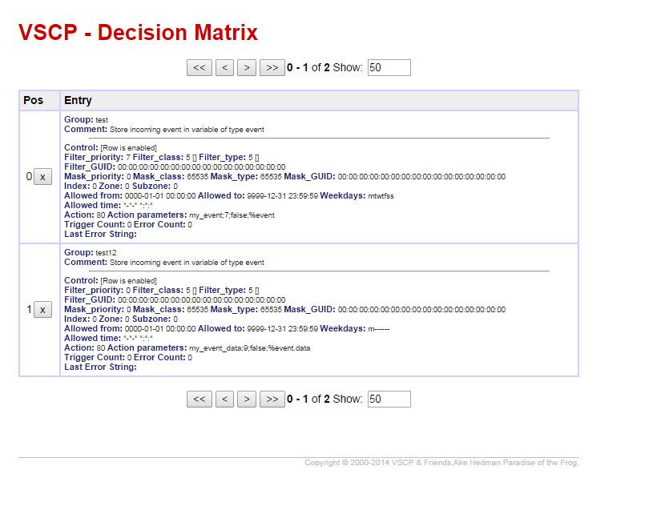
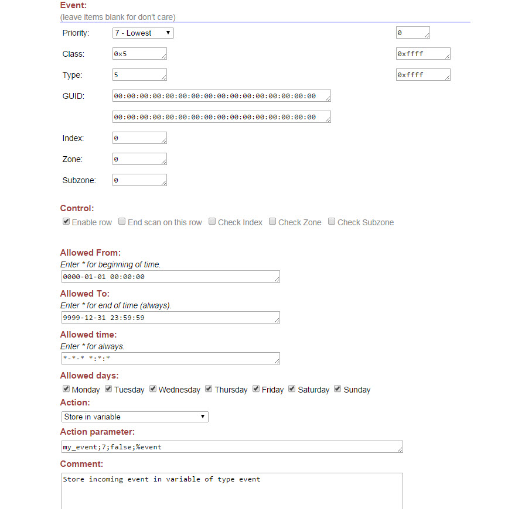
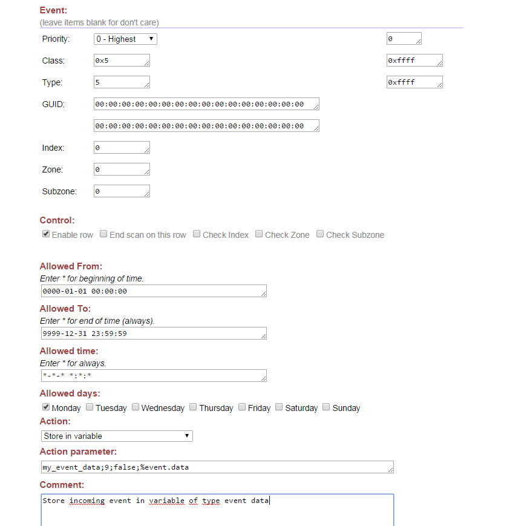
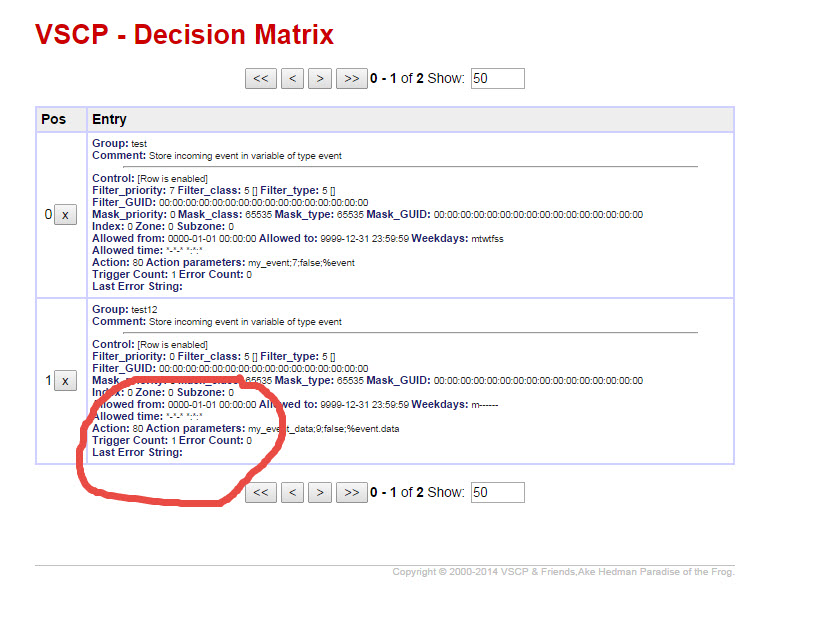
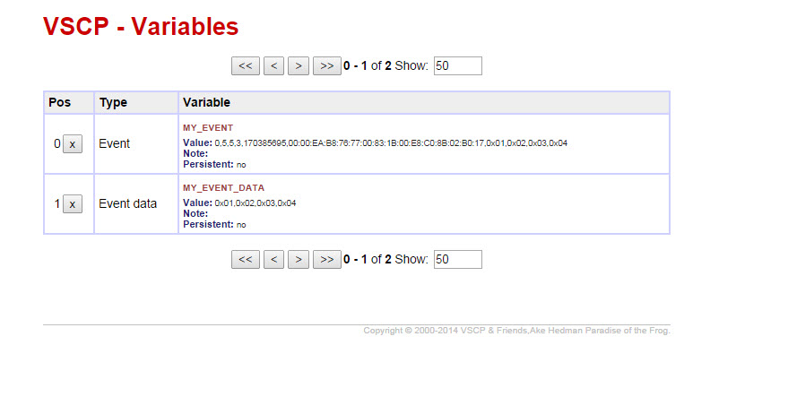
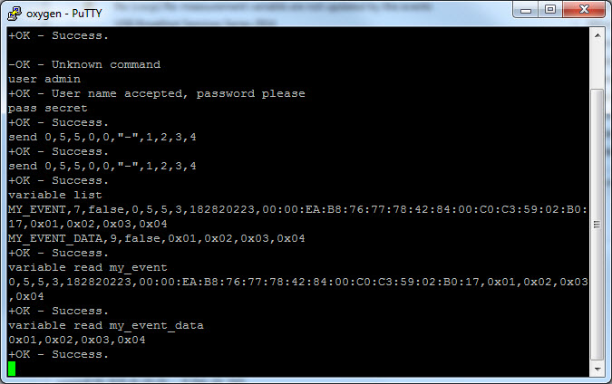

# Debugging decision matrix cases

With all the parameters for decision matrix element it can feel like a daunting task to debug them. 

The first question to always is always - **Was the rows action triggered?** 

You have two items that help you determine if this is the case or not. First of all you have the Trigger Count and the Error Count in the administration interface of the daemon.  In the decision matrix list here you can see how many times an action has been triggered.



The error counter will be increase by one for every **error encounter** and the **trigger counter** will be increase with one for every time the action is performed. So if you send an event that should trigger an action you can use this view as a way to see if it actually happens.

Another tool is the Decision matrix log file. In this file you also can see if actions are triggered and can get a lot of information if you want. See information [here](./configuring_the_vscp_daemon.md).

Let us view a simple example

Suppose we want to save the event that trigger the action in a variable **my_event** and also just the data of the event in an other variable **my_event_data**. To make this sample simple we say that we want to do this for events with class=5 and Type=5. We define two decision matrix elements. One for each case.



and




in the dm.xml this looks like (you can enter this also in your file if you prefere)

```xml
<?xml version = "1.0" encoding = "UTF-8" ?>
<dm>
    <row enable="true" groupid="test" >
    <mask  priority="0"  class="65535"  type="65535"  GUID=" 00:00:00:00:00:00:00:00:00:00:00:00:00:00:00:00" ></mask>
    <filter  priority="7"  class="5"  type="5"  GUID=" 00:00:00:00:00:00:00:00:00:00:00:00:00:00:00:00" ></filter>
    <control>0x80000000</control>
    <action>0x50</action>
    <param>my_event;7;false;%event</param>
    <comment>Store incoming event in variable of type event</comment>
    <allowed_from>0000-01-01 00:00:00</allowed_from>
    <allowed_to>9999-12-31 23:59:59</allowed_to>
    <allowed_weekdays>mtwtfss</allowed_weekdays>
    <allowed_time>-*-* *:*:</allowed_time>
    <index bMeasurement="false" >0</index>
    <zone>0</zone>
    <subzone>0</subzone>
    </row>

    <row enable="true" groupid="test12" >
    <mask  priority="0"  class="65535"  type="65535"  GUID=" 00:00:00:00:00:00:00:00:00:00:00:00:00:00:00:00" ></mask>
    <filter  priority="0"  class="5"  type="5"  GUID=" 00:00:00:00:00:00:00:00:00:00:00:00:00:00:00:00" ></filter>
    <control>0x80000000</control>
    <action>0x50</action>
    <param>my_event_data;9;false;%event.data</param>
    <comment>Store incoming event in variable of type event</comment>
    <allowed_from>0000-01-01 00:00:00</allowed_from>
    <allowed_to>9999-12-31 23:59:59</allowed_to>
    <allowed_weekdays>mtwtfss</allowed_weekdays>
    <allowed_time>-*-* *:*:</allowed_time>
    <index  bMeasurement="false"  >0</index>
    <zone>0</zone>
    <subzone>0</subzone>
    </row>

</dm>
```
 
Now when none of these decision rows have been triggered you will see this if you list your decision matrix


none of the rows has been triggered. Now open a telnet session to your daemon

    telnet localhost 9598

if you are on a default installation.

Enter username and password with

    user admin
    pass secret

User="admin" with password="secret" is set up on a newly installed machine. You may need to change the credentials of course.

In the TCP/IP interface no send

    send 0,5,5,0,0,"-",1,2,3,4
    
this is just a made up event but the only thing we are interested in now is that class=5 and type=5  

Now list the decision matrix again and you will see the trigger count increase by one



and if you check the variable list you find the variables and there values



If you want you can also read the variable in the TCP/IP interface like here



That is

    read my_event
and
    read my_event_data
    


[filename](./bottom_copyright.md ':include')
