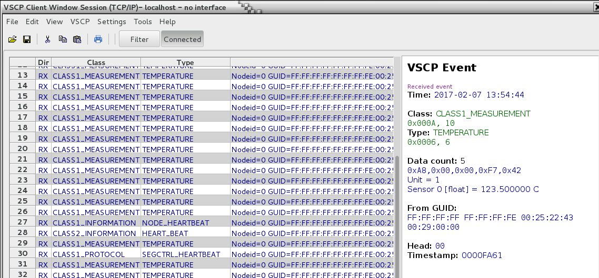
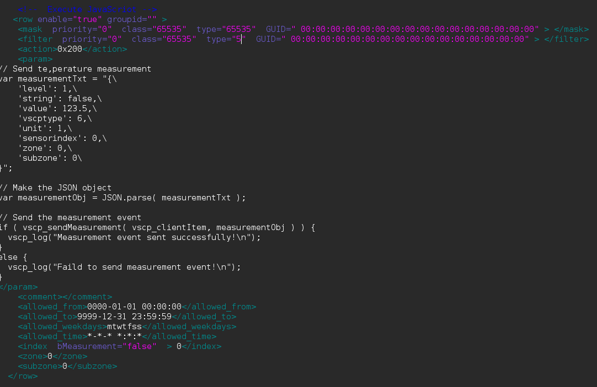

# JavaScript Callbacks

JavaScript callbacks is functions that you can call from JavaScript code in a decision matrix action parameter or in the other places where VSCP JavaScripts can be executed.

## Predefined JavaScript variables

The VSCP daemon creates some predefined variables when a JavaScript is executed. 

*  **vscp_feedEvent** - This is the event that triggered the execution of the JavaScript as a JSON object. See the vent handling functions below for the format. __The variable is read only.__

*  **vscp_clientItem** - This is an object that represent the client the JavaScript is running as. It is created by the VSCP daemon when the script is started. Some function require that you supply this variable as a parameter. __The variable is read only.__

## vscp_print

Can be used for debugging when the server is started in non-debug mode. Output will be outputted in the console window. Nothing will be output if the VSCP server is run as a daemon.

### Parameters

```javascript
vscp_print("Hello World!");
```

## vscp_log

Log data to the VSCP daemon logs. Very well suited for reporting errors and log information. As an alternative one can send VSCP events instead. [CLASS1.LOG](http://docs.vscp.org/spec/latest/#/./class1.log) and [CLASS1.ERROR](http://docs.vscp.org/spec/latest/#/./class1.error) is intended for this use.

### Parameters

```javascript
vscp_log("message"[,nDebugLevel, nType] );
```

*  **message** is required and is the message that is sent to the logs. Please end this message with a new line.

*  **nDebugLevel** is optional and should be 0,1 or 2 where 0 is the lowest debug level, 1 is the normal level and 2 is the debug level. Can be omitted and if so defaults to 1.

*  **nType** is optional and should be 0,1,2,3 and 0 is general log messages, 1 is security log messages, 2 is access log messages and 3 is decision matrix related log messages. Can be omitted and if so defaults to 0.

### Return value

This function will always return a boolean true.

### Example

This script write out the current date on ISO format (YYMMDD) and "Hello World!" to the general log file. The **%isodate** is a [decision matrix escape](./decision_matrix.md#variable_substitution_for_parameters_escapes) and it is replaces with information before the script is executed.

```JavaScript
vscp_log("%isodate  Hello World! \n" );
```

## vscp_sleep

Sleep a number of milliseconds.

### Parameters

```javascript
vscp_sleep(sleeptime );
```


*  **sleeptime** Time to sleep in milliseconds.

### Return value

This function will always return a boolean true.

##  vscp_readVariable

Fetch a VSCP remote variable by name. Variable information is returned in JSON format and a NULL object is returned if no variable with that name exists. You must be the owner of a variable or have read rights to read it.

### Parameters

```javascript
vscp_readvariable( "name");
```

*  **name** of variable.

### Return

Variable information is returned in JSON format or a NULL object is returned if no variable with that name exists.

```json
{  
    "name": "variable-name",
    "type": 1,
    "user": 2,
    "accessrights": 1911,
    "persistence": true|false,
    "lastchange": "YYYYMMDDTHHMMSS",
    "bnumeric": true|false,
    "bbase64": true|false,
    "value": "This is a test variable of type string",
    "note": "This is a note about this variable"
}
```

The variable types are [listed here](./remote_variables.md#variable_types).


*  **bnumeric** is true for a numerical variable. 

*  **bbase64** is true if the value is coded in BASE64, this is true for all string formats. You can use the built in functions [Ductape.dec('base64',string)](http://duktape.org/guide.html#builtin-duktape-dec) and [Duktape.enc('base64',string)](http://duktape.org/guide.html#builtin-duktape-enc) to decode/encode.

### Example

This example reads the variable **test1** which is a numerical VSCP remote variable in the default configuration, it increase the value of it with one and then write it back and finally write the value to the general log file.

```javascript
var obj = vscp_readVariable("test1");              // Read the remote variable 'test1'
obj.value++;                                       // Increase its value 
vscp_writeVariable(obj);                           // Write the new value
obj = vscp_readVariable("test1");                  // Read back the remote variable
vscp_log("Variable value = " + obj.value + "\n" ); // Log 
```

##  vscp_writeVariable

Create or change a VSCP remote variable. The variable is created if it does not exist. You must be the owner of a variable or have write access to read it.

### Parameters

```javascript
vscp_writeVariable( Variable-JSON-object );
```


*  **Variable-JSON-object** The variable data as a JSON object. See the return data for the [vscp_readVariable](javascript_callbacks#return) function for format. If the variable is existing only **value** and **note** will be read and changed. **name** must be available for obvious reasons.

```json
{  
    "name": "variable-name",
    "type": typeid | string-typeid,
    "user": userid | "username"
    "accessrights": 1911,
    "persistence": true|false,
    "value": "This is a test variable of type string (BASE64 encoded if string)",
    "note": "This is a note about this variable (must be BASE64 encoded)"
}
```


*  **name** is a __required parameter__.

*  **type** defaults to 1 (string).

*  **accessrights** defaults to 0x700 (all rights to owner).

*  **persistence** defaults to *false* (will not survive a restart of VSCP daemon).

*  **value** should be enclosed in quotes and be BASE64 encoded for all variables that are in string format. No quotes for numerical types. __Parameter is required.__

*  **note** Should always be BASE64 encoded if present.

### Return

Return boolean *true* on success and *false* on failure.

**Example**

Increase a numerical variable value by one and save the variable again

```javascript
var obj = vscp_readVariable("test1");
obj.value++;
vscp_writeVariable( obj );
obj = vscp_readVariable("test1");
vscp_log("Variable value = " + obj.value );
```


**Example**

Define a new string variable. Read it back and print the content.

```javascript
var obj1 = JSON.parse('{ \
    "name": "newtestvariable", \
    "type": 1, \
    "user": "admin", \
    "accessrights": 777, \
    "persistence": false, \
    "value": "VGhpcyBpcyBhIHRlc3QgdmFyaWFibGUgb2YgdHlwZSBzdHJpbmcgKEJBU0U2NCBlbmNvZGVkIGlmIHN0cmluZyk=", \
    "note": "VGhpcyBpcyBhIG5vdGUgYWJvdXQgdGhpcyB2YXJpYWJsZSAobXVzdCBiZSBCQVNFNjQgZW5jb2RlZCk=" }');
vscp_log("* * * JSON variable name = " + obj1.name );   
vscp_writeVariable(obj1);                                     // Write the new value
var obj2 = vscp_readVariable(obj1.name);                      // Read back the remote variable
var decvalue = Object( Duktape.dec('base64', obj2.value ) );  // decode to utf8 array
var strvalue = new TextDecoder().decode(decvalue);            // Make string of the array
vscp_log("* * * JSON Variable value = " + obj2.value + " =  " + strvalue ); 
vscp_log("* * * JSON Variable type = " + obj2.type );
vscp_log("* * * JSON Variable user = " + obj2.user );
vscp_log("* * * JSON Variable accessrights = " + obj2.accessrights );
vscp_log("* * * JSON Variable persistence = " + obj2.persistence );
vscp_log("* * * JSON Variable lastchange = " + obj2.lastchange );
vscp_log("* * * JSON Variable bnumeric = " + obj2.bnumeric );
vscp_log("* * * JSON Variable bbase64 = " + obj2.bbase64 );
```

The first part of this code can be changed to

```javascript
var obj1 = JSON.parse('{ \
    "name": "newtestvariable", \
    "type": 1, \
    "user": "admin", \
    "accessrights": 777, \
    "persistence": false }');
obj1.note = Duktape.enc('base64',"This is a note that now will be BASE64 encoded");
obj1.value = Duktape.enc('base64',"This is a BASE64 encoded string value.");
```

to decode clear text value before assigning it to the JSON object.

**Example**

Create a floating point variable

```javascript
var obj1 = JSON.parse('{ \
          "name": "newtestvariable", \
          "type": 5, \
          "user": "admin", \
          "accessrights": 777, \
          "persistence": false }');
      obj1.note = Duktape.enc('base64',"This is a note that now will be BASE64 encoded");
      obj1.value = 123.4567;
      obj1.value = obj1.value * 99;
      obj1.accessrights = 99
      vscp_log("* * * JSON variable name = " + obj1.name + "\n" );   
      vscp_writeVariable(obj1);                                     // Write the new value
      var obj2 = vscp_readVariable(obj1.name);                      // Read back the remote variable
      vscp_log("* * * JSON Variable value = " + obj2.value  ); 
      vscp_log("* * * JSON Variable type = " + obj2.type );
      vscp_log("* * * JSON Variable user = " + obj2.user );
      vscp_log("* * * JSON Variable accessrights = " + obj2.accessrights );
      vscp_log("* * * JSON Variable persistence = " + obj2.persistence );
      vscp_log("* * * JSON Variable lastchange = " + obj2.lastchange );
      vscp_log("* * * JSON Variable bnumeric = " + obj2.bnumeric );
      vscp_log("* * * JSON Variable bbase64 = " + obj2.bbase64 );
      var decnote = Object( Duktape.dec('base64', obj2.note ) );  // decode to utf8 array
      var strnote = new TextDecoder().decode(decnote);            // Make string of the array
      vscp_log("* * * JSON Variable note = " + obj2.note + " =  " + strnote );
```

##  vscp_deleteVariable

Delete a VSCP remote variable. You must be the owner of a variable or have write access to be able to delete it.

### Parameters

```javascript
vscp_deleteVariable( vscp_clientItem, "name of variable" );
```


*  **vscp_clientItem** A vscpd supplied object that specify a unique VSCP client this JavaScript is acting as. This variable is created by vscpd when the script is executed.

*  **name of variable** of variable.

### Return

Return boolean *true* on success and *false* on failure. 

### Example
```javascript
if ( vscp_deleteVariable( "testVariable" ) ) {
    vscp_log("Variable deleted.\n" );
}
else {
    vscp_log("Failed to delete variable!\n" );
}
```

##  vscp_sendEvent

Send a VSCP event.

### Parameters

```javascript
vscp_sendEvent( vscpEvent );
```

* **vscpEvent** A JSON object that contain the VSCP event data as of below.

The VSCP Event object has the following format

```json
{
    "time": "20161102T190032",
    "head": 96,
    "timestamp": 0,
    "obid":  0,
    "class": 10,
    "type": 6,
    "guid": "00:00:00:00:00:00:00:00:00:00:00:00:00:00:00:00",
    "data": [1,2,3,4,5,6,7,8...]
    "note": "A note about the event"
}
```

**note** has no use in this case and can be left out. **head** if left out defaults to 96 which is *normal priority*. **timestamp** and **obid** both defaults to zero meaning they will be filled in by the system. **guid** can be set to "-" or all nulls (same as being omitted) and the GUID of the interface is then used. **data** can be omitted and is in that case the same as no data. If "time" is left out the current UTC time is used. 

### Return

Return boolean *true* on success and *false* on failure.

### Example

Send [Turn-On-event](http://docs.vscp.org/spec/latest/#/./class1.control?id=type5-0x05-turnon).

```javascript
// Send CLASS1.CONTROL, Type=5, TurnOn, Zone=11, Subzone=3
var event = { time:"2016-11-02T19:00:32", 
                head:0, 
                timestamp:0, 
                obid:0, 
                class: 30, 
                type: 5, 
                guid: "00:00:00:00:00:00:00:00:00:00:00:00:00:00:00:00", 
                data: [0,11,3] };

if ( vscp_sendEvent(event) ) {
    vscp_log("TurnOn event sent successfully!");
}
else {
    vscp_log("Failed to send TurnOn event!");
}
```

##  vscp_receiveEvent

Receive a VSCP event from the local queue.

### Parameters

```javascript
var event = vscp_receiveEvent()
```


### Return

Return VSCP Event object on success and NULL on failure. See vscp_sendEvent for the format for the received JSON event object.

### Example

Print out received events on the log until the event [CLASS1.INFORMATION, Type=Stop, 8](http://docs.vscp.org/spec/latest/#/./class1.control?id=type8-0x08-stop) is received.  Note that the loop construct here without a delay is not to recommend as it eats a lot of CPU time.

```javaScript
var vscpEventObj;       // JSON object containing VSCP event
var bQuit = false;

// Keep on until done
while ( !bQuit ) {

    // Fetch event from client queue
    vscpEventObj= vscp_receiveEvent();

    if ( null != vscpEventObj ) {

        vscp_log("VSCP event received: class = " + vscpEventObj.class.toString() + " type = " + vscpEventObj.type.toString() + "\n");

        // Event CLASS1.INFORMATION, Type=Stop, 8 terminates the loop
        if ( 30 == vscpEventObj.class ) {
            if ( 8 == vscpEventObj.type ) {
                bQuit = true;
            }
        }
    }
    else {
        vscp_sleep( 500 );
    }
}

vscp_log("Done!\n");

```

You can log in to the tcp/ip interface and issue

    send 96,30,8,0,0,-,0,0,0

to terminate the loop. That is send CLASS1.INFORMATION, Type=Stop, 8

Also note the 

```javascript
if ( 30 == vscpEventObj.class ) {
    if ( 8 == vscpEventObj.type ) {
    bQuit = true;
    }
}
```

which would have been written as

```javascript
if ( (30 == vscpEventObj.class) && ( 8 == vscpEventObj.type ) ) {
    bQuit = true;
}
```

by a sane programmer. But the reason we don't use that here is because of the double ampersands ,"&&", in the and statement which is not allowed in XML. They could be replaced by two **&amp;&amp;** to make the code valid XML.

```javascript
if ( (30 == vscpEventObj.class) &amp;&amp; ( 8 == vscpEventObj.type ) ) {
    bQuit = true;
}
```

Another option is to code the code in BASE64 and tell the system so by preceding it with "BASE64:" so it is converted to a string before VSCP decision matrix escapes is written and before it is executed. In this case the parameter line would look like

```base64
BASE64:dmFyIHZzY3BFdmVudE9iajsgICAgICAgLy8gSlNPTiBvYmplY3QgY290YWluaW5nIFZTQ1AgZXZlbnQNCnZhciBiUXVpdCA9IGZhbHNlOw0KDQovLyBLZWVwIG9uIHVudGlsIGRvbmUNCndoaWxlICggIWJRdWl0ICkgew0KDQogICAgLy8gRmV0Y2ggZXZlbnQgZnJvbSBjbGluZXQgcXVldWUNCiAgICB2c2NwRXZlbnRPYmo9IHZzY3BfcmVjZWl2ZUV2ZW50KCB2c2NwX2NsaWVudEl0ZW0gKTsNCg0KICAgIGlmICggbnVsbCAhPSB2c2NwRXZlbnRPYmogKSB7DQoNCiAgICAgICAgdnNjcF9sb2coIlZTQ1AgZXZlbnQgcmVjZWl2ZWQ6IGNsYXNzID0gIiArIHZzY3BFdmVudE9iai5jbGFzcy50b1N0cmluZygpICsgIiB0eXBlID0gIiArIHZzY3BFdmVudE9iai50eXBlLnRvU3RyaW5nKCkgKyAiXG4iKTsNCg0KICAgICAgICAvLyBFdmVudCBDTEFTUzEuSU5GT1JNQVRJT04sIFR5cGU9U3RvcCwgOCB0ZXJtaW5hdGVzIHRoZSBsb29wDQogICAgICAgIGlmICggMzAgPT0gdnNjcEV2ZW50T2JqLmNsYXNzICkgew0KICAgICAgICAgICAgaWYgKCA4ID09IHZzY3BFdmVudE9iai50eXBlICkgew0KICAgICAgICAgICAgICAgIGJRdWl0ID0gdHJ1ZTsNCiAgICAgICAgICAgIH0NCiAgICAgICAgfQ0KICAgIH0NCn0NCg0KdnNjcF9sb2coIkRvbmUhXG4iKTs=
```

The later gives much nicer XML code.

##  vscp_countEvent

Return number of VSCP events in the local queue.

### Parameters

```javascript
vscp_countEvent( vscp_ClientItem )
```

* **vscp_ClientItem** A vscpd supplied object that specify a unique VSCP client this JavaScript is acting as. This variable is created by vscpd when the script is executed.

### Return

Return the number of events waiting in the client queue for this JavaScript. A client is opened when the script is started and remains open until the script has terminated.

### Example

Check the client queue five times with a ten second delay between the checks.  Note that the "less than" (<) symbol is not allowed in XML and should be replaced by **\&lt;** if this is used in the dm.xml file.

```javascript
for ( i=0; i &lt; 5; i++ ) {
    var count = vscp_countEvent();
    vscp_log("Number of VSCP events in client queue is " + count.toString() + " i = " + i.toString() + "\n"  );
    vscp_sleep( 10000 );
}
```

Note the **&lt;** instead of **<** to get well formed XML.  Could use the **BASE64:"Javascript...."** form instead which does not need this replacement.
##  vscp_setFilter

Set a VSCP filter for this clients local queue. This filter limits the events received on this interface.

### Parameters

```javascript
vscp_setFilter( vscp_ClientItem, vscpFilterObject )
```

* **vscp_ClientItem** A vscpd supplied object that specify a unique VSCP client this JavaScript is acting as. This variable is created by the VSCP daemon when the script is executed.

* **vscpFilterObject** A JSON filter object specifying a complete VSCP filter.

```json
{
    "mask_priority": number,
    "mask_class": number,
    "mask_type": number,
    "mask_guid": "string",
    "filter_priority"; number,
    "filter_class": number,
    "filter_type": number,
    "filter_guid" "string"
}
```

### Return

Return boolean *true* on success and *false* on failure.

### Example

Set filer so that only [CLASS1.MEASUREMENT](http://docs.vscp.org/spec/latest/#/./class1.measurement) events is received. 

```javascript
// Allow only CLASS1.MEASUREMENT events, from all, 
// with all priorities
var filterTxt = '{\
    "mask_priority": 0,\
    "mask_class": 65535,\
    "mask_type": 0,\
    "mask_guid": "00:00:00:00:00:00:00:00:00:00:00:00:00:00:00:00",\
    "filter_priority": 0,\
    "filter_class": 10,\
    "filter_type": 0,\
    "filter_guid": "00:00:00:00:00:00:00:00:00:00:00:00:00:00:00:00"\
}';
 
// Make the JSON object
var filterObj = JSON.parse( filterTxt );
 
// Set the filter
if ( vscp_setFilter( filterObj ) ) {
    vscp_log("Filter set successfully!\n");
}
else {
    vscp_log("Faild to set filter!\n");
}
```
##  vscp_sendMeasurement

Send a measurement event. A level I or Level II measurement event can be sent with this function with the measurement supplied as a floating point value.

### Parameters

```javascript
vscp_sendMeasurement( vscp_ClientItem, vscpMeasurementObject );
```


*  **vscp_ClientItem** A vscpd supplied object that specify a unique VSCP client this JavaScript is acting as. This variable is created by vscpd when the script is executed.

*  **vscpMeasurementObject** A JSON measurement object that specify the properties of the measurement.

```json
{
    "level": 1|2, 
    "bstring": true|false,
    "value": 123.5,
    "guid": "00:00:00:00:00:00:00:00:00:00:00:00:00:00:00:00",
    "vscptype": 6,
    "unit": 1,  
    "sensorindex": 0, 
    "zone": 0, 
    "subzone": 0 
}
```


*  **level** is either 1 or 2 for Level I or level II events or if not given it defaults to 2.

*  **bstring** Only valid for Level II events. If true a [CLASS2.MEASUREMENT_STR](http://docs.vscp.org/spec/latest/#/./class2.measurement_strl). If false a [CLASS2.MEASUREMENT_FLOAT](http://docs.vscp.org/spec/latest/#/./class2.measurement_float). If not given defaults to false-

*  **value** A double representing the measurement value. A required value.

*  **guid** Optional. Defaults to all nulls that is the GUID of the interface is used.

*  **vscptype** This is the [measurement type](http://www.vscp.org/docs/vscpspec/doku.php?id=class1.measurement). A required value.

*  **unit** The unit for the measurement. Defaults to 0 (the default unit). Can be 0-3 for a level I measurement and 0-255 for a level II measurement.

*  **sensorindex** The sensor index for the measurement. Defaults to 0.  Can be 0-7 for a level I measurement and 0-255 for a level II measurement.

*  **zone** The zone for the measurement. Defaults to 0.  Can be 0-255 for a level I measurement and 0-255 for a level II measurement.

*  **subzone** The subzone for the measurement.Defaults to 0.  Can be 0-255 for a level I measurement and 0-255 for a level II measurement.

### Return

Return boolean *true* on success and *false* on failure.

### Example

```javascript
// Send temperature measurement
var measurementTxt = "{\
    "level": 1,\
    "bstring": false,\
    "value": 123.5,\
    "guid": "00:00:00:00:00:00:00:00:00:00:00:00:00:00:00:00",\
    "vscptype": 6,\
    "unit": 1,\
    "sensorindex": 0,\
    "zone": 0,\
    "subzone": 0\
}";

// Make the JSON object
var measurementObj = JSON.parse( measurementTxt );

// Send the measurement event
if ( vscp_sendMeasurement( vscp_clientItem, measurementObj ) ) {
    vscp_log("Measurement event sent successfully!\n");
}
else {
    vscp_log("Failed to send measurement event!\n");
}
```

This is how the resulting event looks like in VSCP Works.



And this is the decision matrix row. Not that [CLASS2.VSCPD,Type=Second,5 event](http://docs.vscp.org/spec/latest/#/./class2.vscpd?id=type5-0x05-second) is used to send the measurement event every second. There are many possibilities here such as once on start up, every hour etc.



To send the same Level I measurement in string form use

```javascript
var measurementTxt = "{\
    "level": 1,\
    "bstring": true,\
    "value": 123.5,\
    "guid": "00:00:00:00:00:00:00:00:00:00:00:00:00:00:00:00",\
    "vscptype": 6,\
    "unit": 1,\
    "sensorindex": 0,\
    "zone": 0,\
    "subzone": 0\
}";
```

To send the same measurement in Level II string form use

```javascript
var measurementTxt = "{\
    "level": 2,\
    "bstring": true,\
    "value": 123.5,\
    "guid": "00:00:00:00:00:00:00:00:00:00:00:00:00:00:00:00",\
    "vscptype": 6,\
    "unit": 1,\
    "sensorindex": 0,\
    "zone": 0,\
    "subzone": 0\
}";
```

To send the same measurement in Level II floating point form use

```javascript
var measurementTxt = "{\
    "level": 2,\
    "bstring": false,\
    "value": 123.5,\
    "guid": "00:00:00:00:00:00:00:00:00:00:00:00:00:00:00:00",\
    "vscptype": 6,\
    "unit": 1,\
    "sensorindex": 0,\
    "zone": 0,\
    "subzone": 0\
}";
```
##  vscp_isMeasurement

Check if this VSCP event is a measurement event.

### Parameters

```javascript
vscp_isMeasurement( event )
```


*  **event** A JSON object that contain the VSCP event data. See [vscp_sendEvent](./javascript_callbacks.md#vscp_sendevent) for the format.

### Return

Return boolean *true* if the event is a measurement event and *false* if not.


##  vscp_getMeasurementValue

Get a measurement value from a VSCP measurement event.

### Parameters

```javascript
vscp_getMeasurementValue( event )
```


*  **event** A JSON object that contain the VSCP event data. See [vscp_sendEvent](./javascript_callbacks.md#vscp_sendevent) for the format.

### Return

Return the value for the measurement as a double or null if error or if event is not a measurement or an error occures.

### Example

```javascript
// The JSON text CLASS1.MEASUREMENTL, Type= Temperature,6 sensorindex=0, unit=1 (Celsius) 
// 45.464 degrees Celsius 
var eventTxt = "{ 'class': 10, 'type': 6, 'data': [0x48,0x34,0x35,0x2E,0x34,0x36,0x34] }";
 
// Make the JSON object
var event = JSON.parse( eventTxt );

if ( null != ( value = vscp_getMeasurementValue( event ) ) ) {
    vscp_log("Measurement event sent successfully! value = " + value.toString() + "\n");
}
else {
    vscp_log("This is not a measurement event!\n");
}
```
##  vscp_getMeasurementUnit

Get a measurement unit from a VSCP measurement event.

### Parameters

```javascript
vscp_getMeasurementUnit( event )
```


*  **event** A JSON object that contain the VSCP event data. See [vscp_sendEvent](./javascript_callbacks.md#vscp_sendevent) for the format.

### Return

Return the unit for the measurement as an integer or null if error or if event is not a measurement.

### Example

Will output Unit = 1.

```javascript
// The JSON text CLASS1.MEASUREMENTL, Type= Temperature,6 sensorindex=1, unit=1 (Celsius) 
// 45.464 degrees Celsius 
var eventTxt = "{ 'class': 10, 'type': 6, 'data': [0x49,0x34,0x35,0x2E,0x34,0x36,0x34] }";
 
// Make the JSON object
var event = JSON.parse( eventTxt );

vscp_log("Unit = " + vscp_getMeasurementUnit( event ).toString() + "\n");
```

##  vscp_getMeasurementSensorIndex

Get a measurement sensor index from a VSCP measurement event.

### Parameters

```javascript
vscp_getMeasurementSensorIndex( event )
```


*  **event** A JSON object that contain the VSCP event data. See [vscp_sendEvent](./javascript_callbacks.md#vscp_sendevent) for the format.

### Return

Return the sensorindex for the measurement as an integer or null if error or if event is not a measurement.

### Example

Will output sensorindex = 1.

```javascript
// The JSON text CLASS1.MEASUREMENTL, Type= Temperature,6 sensorindex=1, unit=1 (Celsius) 
// 45.464 degrees Celsius 
var eventTxt = "{ \"class\": 10, \"type\": 6, \"data\": [0x49,0x34,0x35,0x2E,0x34,0x36,0x34] }";
 
// Make the JSON object
var event = JSON.parse( eventTxt );

vscp_log("Sensor index = " + vscp_getMeasurementSensorIndex( event ).toString() + "\n");
```

##   vscp_getMeasurementZone

Get a measurement zone from a VSCP measurement event.

### Parameters

```javascript
vscp_getMeasurementZone( event )
```


*  **vscpEventObject** A JSON object that contain the VSCP event data. See [vscp_sendEvent](./javascript_callbacks.md#vscp_sendevent) for the format.

### Example

Will output Zone = 0.

```javascript
// The JSON text CLASS1.MEASUREMENTL, Type= Temperature,6 sensorindex=1, unit=1 (Celsius) 
// 45.464 degrees Celsius 
var eventTxt = "{ \"class\": 10, \"type\": 6, \"data\": [0x49,0x34,0x35,0x2E,0x34,0x36,0x34] }";
 
// Make the JSON object
var event = JSON.parse( eventTxt );

vscp_log("Zone = " + vscp_getMeasurementZone( event ).toString() + "\n");
```
### Return

Return the zone for the measurement as an integer or null if error or if event is not a measurement. Level I events that does not have a zone defined will get a zero returned.

##   vscp_getMeasurementSubZone

Get a measurement Sib Zone from a VSCP measurement event.

### Parameters

```javascript
vscp_getMeasurementSubZone( event )
```


*  **vscpEventObject** A JSON object that contain the VSCP event data. See [vscp_sendEvent](./javascript_callbacks.md#vscp_sendevent) for the format.

### Return

Return the subzone for the measurement as an integer or null if error or if event is not a measurement.  Level I events that does not have a zone defined will get a zero returned.

### Example

Will output Subzone = 0.

```javascript
// The JSON text CLASS1.MEASUREMENTL, Type= Temperature,6 sensorindex=1, unit=1 (Celsius) 
// 45.464 degrees Celsius 
var eventTxt = "{ \"class\": 10, \"type\": 6, \"data\": [0x49,0x34,0x35,0x2E,0x34,0x36,0x34] }";
 
// Make the JSON object
var event = JSON.parse( eventTxt );

vscp_log("Subzone = " + vscp_getMeasurementSubZone( event ).toString() + "\n");
```

[filename](./bottom_copyright.md ':include')


