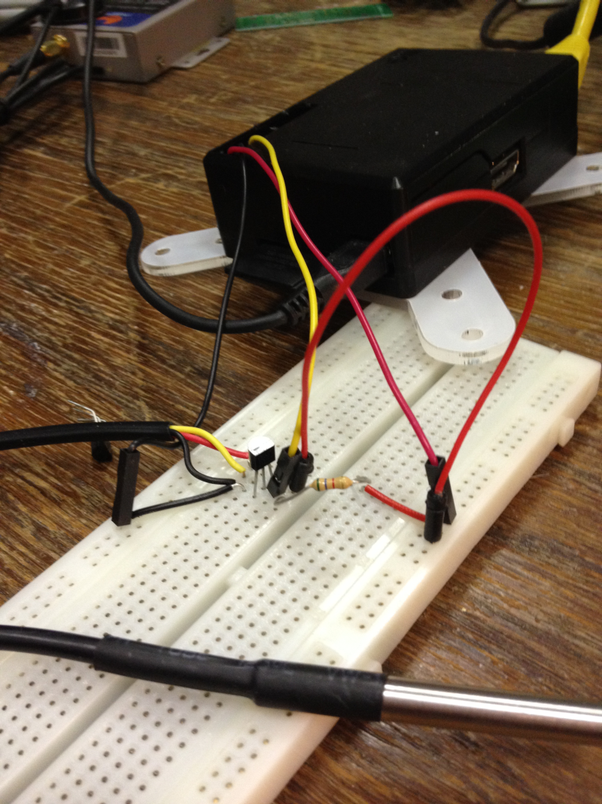

# Wire1 (1-wire) Level II driver

**Available for**: Linux (Kernel v2.6.29+)

1-Wire sensors especially the [DS18B20](https://datasheets.maximintegrated.com/en/ds/DS18B20.pdf) temperature sensor is extremely popular in the hobby community for it's ease of use. Also the possibility to have many sensors connected on one 1-wire bus is a big plus for this sensor.

The wire1 driver is built to take advantage of the 1-wire support that is available in the Linux kernel from version 2.6.29.

This driver reports temperature from any number of DS18B20 temperature sensors connected to a Linux system. The reported event is [CLASS1.MEASUREMENT, Type=6 temperature](https://grodansparadis.gitbooks.io/the-vscp-specification/content/class1.measurement.html#type6-0x06-temperature).

**Driver Linux**: vscpl2_wire1.so

The configuration string has the following format

    NumberOfSensors

##### NumberOfSensors

The parameter *NumberOfSensors* (which is optional) is the number of sensors the driver should report data from. This value can also be available as a VSCP daemon variable and if both are present the VSCP daemon variable will be used. Default is 1. 

 | Variable name    | Type    | Description  | 
 | -------------    | ----    | -----------  | 
 | _numberofsensors | integer | NumberOfSensors is the number of sensors the driver should report data from. | 
 | _path[0..n]      | string  | Path to the lm-sensor data file.  | 
 | _guid[0..n]      | guid    | GUID to use when the data for the sensor is reported.  If no GUID is used the reserved GUID for 1-wire with the unique id for the sensor will be used. | 
 | _interval[0..n]  | integer | Sample interval in seconds for events. Default is 30 seconds. | 
 | _unit[0..n]      | integer | Unit use. Allowed values 0=Kelvin,1=Celsius or 2=Fahrenheit. Default is 2 (Celsius).  | 
 | _index[0..n]     | integer | Measurement index 0-7. Default is 0. | 
 | _coding[0..n]    | integer | Message coding 0-2. Default is 0. Allowed values 0=Normalized integer, 1=string, 2=floating point. | 

The full variable name is built from the name you give the driver (prefix before _variablename) in vscpd.conf. So in the examples below the driver have the name **wire1** and the full variable name for the **_numberofsensors** will thus be

    wire11_numberofsensors

If you have another diver and name it  **wire2** it will therefore instead request variable **wire2_numberofsensors**

If your driver name contains spaces, for example “name of driver” it will get a prefix that is “name_of_driver”. Leading and trailing spaces will be removed. 

##### Example of vscpd.conf entry for the wire1 driver.

```xml
<driver enable="true" >
    <name>wire1</name>
    <path>/usr/local/lib/vscpl2_wire1.so</path>
    <config>2</config>
    <guid>00:00:00:00:00:00:00:00:00:00:00:00:00:00:00:00</guid>
</driver>
```

Example for variable configuration. In this sample the temperature from two DS18B20 temperature sensors is reported every ten seconds.

```xml
<!-- ******************************************************** -->
<!--            VSCP wire1 Level II driver variables     -->
<!-- ******************************************************** -->
<!-- Number of sensors to read -->
<variable type="int" >
	<name>wire1_numberofsensors</name>          	
	<value>2</value>      
</variable>

<!-- ******************************************************** -->
<!--           Variables for temperature sensor 1        -->
<!-- ******************************************************** -->

<!-- Interval for temperature reports -->
<variable type="int" >
	<name>wire1_interval0</name>          	
	<value>10</value>      
</variable>

<!-- VSCP GUID -->
<!-- We use the automatically generated GUID 
     (1-wire guid + sensor id)  -->

<!-- Path to sensor data file for sensor 1 -->
<variable type="string" >
<name>`wire1_path0`</name>
<value>`/sys/bus/w1/devices/28-00000548476b/w1_slave`</value>
</variable>


<!-- ******************************************************** -->
<!--           Variables for temperature sensor 2        -->
<!-- ******************************************************** -->

<!-- Interval for temperature sensor 2 -->
<variable type="int" >
	<name>wire1_interval1</name>          	
	<value>10</value>      
</variable>

<!-- VSCP GUID -->
<!-- We use the automatically generated GUID 
     (1-wire GUID + sensor id)  --> 	

<!-- Path to sensor data file for sensor 2 -->
<variable type="string" >	
	<name>wire1_path1</name>          	
	<value>/sys/bus/w1/devices/28-000003e71198/w1_slave</value>      
</variable>

```


----

# Using the Level II wire1 driver

The 1-wiew support is yet quite limited on Linux systems and at the moment only memory and temperature devices are really supported. The wire1 driver currently just support temperature readings.

## Loading the kernel driver

**Info**

*  https://www.kernel.org/doc/Documentation/w1/w1.generic
*  How to configure - https://how-to.wikia.com/wiki/How_to_configure_the_Linux_kernel/drivers/w1

For the 1-wire subsystem to support you need to first add a master driver for the 1-wire bus. Popular is the now discontinued DS2490 USB adapter. To get a working system reading temperatures if you have this device you need to load the needed modules

    modprob ds2490
    modprob w1-term

If you have some other interface than DS2490 search for which driver to use. 

If you have a Raspberry Pi you can instead use GPIO4 (pin 7) which have support for 1-Wire. You have to add a 4k7 pull up resistor to 3.3V yourself.

On the latest kernel builds on Raspberry Pi you need to add "dtoverlay=w1-gpio" to /boot/config.txt for any of this to work! 

To get it all working

    modprob w1-gpio
    modprob w1_therm

After this is done temperature sensor will be visible in the folder */sys/bus/w1/devices* 

For exampel

    /sys/bus/w1/devices/10-00080192afa8/w1_slave

Will show have a file content of where t=4937 is the temperature * 1000

    0a 00 4b 46 ff ff 0d 10 79 : crc=79 YES
    0a 00 4b 46 ff ff 0d 10 79 t=4937 

This is the file that is read by the wire1 driver and sent to the VSCP subsystem.

You way want to add the modules to **/etc/modules** so that they load automatically the next time you start your system.

# Hooking up a Ds18B20 to Raspberry Pi



On this picture a standard DS18B20 and a water proof sensor with a DS19B20 is connected to the Raspberry Pi. The connection is very easy.


*  Fetch power from pin 1 - 3.3V

*  Fetch ground from pin 6.

*  The reserved 1-Wire pin is GPIO4 which is on pin 4.

A good pin out diagram can be found here {{https://howto8165.files.wordpress.com/2014/08/rpi-pinout.png?600}}

Click to see in full size.

A wiring diagram is here {{http://www.sbprojects.com/projects/raspberrypi/ds1820connect.png?400}}

Note the 4k7 pullup that should be connected from 3.3V to the data line of the sensor.

To be complete we include the DS18B20 pin out also

{{https://www.modmypi.com/image/data/tutorials/DS18B20/DS18B20+.png?200}}


