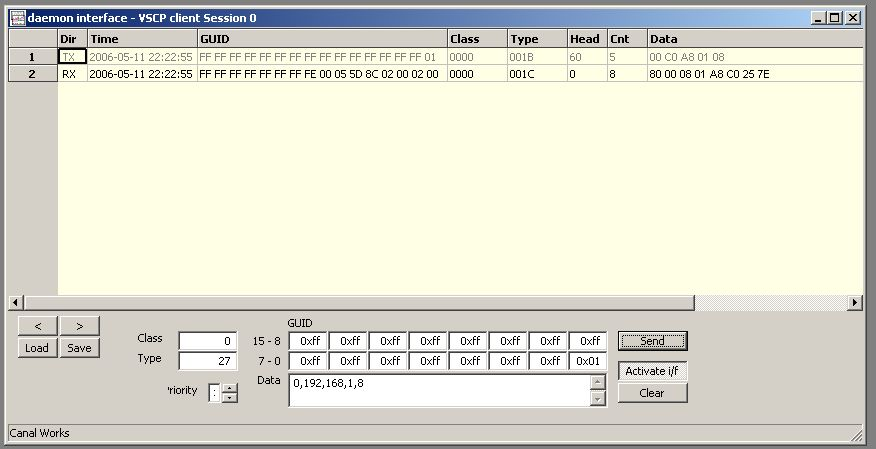

# VSCP Daemon TCP/IP Control Interface

 
The TCP/IP interface is a very powerful tool to control the VSCP daemon remotely as it allow for full control of the functionality of the daemon. Originally the TCP/IP interface was added to allow for a more secure way to send events over TCP/IP links. This interface will have a fair better chance to work over wireless and other links that are hard to get to work reliable with UDP.  

## GUID assigned to the interface

Just as with all clients that connect to the daemon each TCP client interface gets a GUID assigned to it. This GUID is assigned by setting it to the GUID the interface was assigned at start up (in the [configuration file](./configuring_the_vscp_daemon.md) ). This means that a client GUID has the following general form

    yy yy yy yy yy yy yy yy yy yy yy yy client_id_MSB client_id_LSB 0 0

where the the assigned GUID is represented by yy and client_id is a system unique ID for this client interface.

If no GUID is assigned in the configuration file the Ethernet MAC address of the computer vscpd is running on using the VSCP Ethernet assignment method ( see Assigned GUID's ). This results in a GUID of the following form

    FF FF FF FF FF FF FF FE yy yy yy yy client_id_MSB client_id_LSB 0 0 

where yy is the four most significant bytes of the Ethernet address and FF is decimal 255. Note that as the two least significant bytes of the MAC address is dropped there is a chance for duplicated GUID's in a network with more then one machine with a network card from the same manufacturer. In this case set a unique GUID in the configuration file.

Another possibility is to use the IP address of the computer

    FF FF FF FF FF FF FF FD yy yy yy yy client_id_MSB client_id_LSB 0 0 

where yy is the IP address and FF is decimal 255.

The client_id is present in each VSCP event data structure and if a client uses more then one connection to the daemon this client_id can be used to detect events that it has sent itself when they arrive on the other open interfaces. This is typical used when the RCVLOOP command is issued where typically one interface is used to send events and another is used to receive events. By saving the client_id for the transmitting channel events that is sent on this channel can be detected on the receive channel.

When an event is sent from the driver interface ( a CANAL event ) the nickname-ID is stored in the LSB GUID byte (GUID[0]). 

## Server discovery

A node that needs a TCP connection to a server broadcasts High end server probe Class=0, Type = 27 (0x1B) on the segment and waits for High end server response Class=0, Type = 28 (0x1C) from one or more servers that serve the segment. If a suitable server has responded it can decide to connect to that server.

A daemon like the VSCP daemon can span multiple segments and a reply can therefore be received from a remote segment as well. This can be an advantage in some cases and unwanted in other cases. The server configuration should have control on how it is handled.

As an example: In this picture VSCP Works has been used to broadcast a High end server probe from the machine with IP address 192.168.1.8 - Data is 0,192,168,1,8 - The initial zero indicates that this is a TCP/IP based device. The server that in this case is on the same machine have answered with a High end server response with data set to

    80 00 08 01 A8 C0 25 7E

The first two bytes is the bit-filed that tells the Code for server capabilities. After that follows the server IP address (192.168.1.8) followed by the VSCP default port 9598.
In clear text, this server has a VSCP TCP/IP interface available at the standard port.
Other scenarios could be possible of course such as several servers responding and each of the servers supporting different capabilities.

The High end server probe and High end server response is described here [Class=0 (0x00) VSCP Protocol Functionality - CLASS1.PROTOCOL](http://docs.vscp.org/spec/latest/#/./class1.protocol?id=type27-0x1b-high-end-serverservice-probe)

A node can react in its own manner on the response. It can connect to the server itself or wait for the server to connect to the node.

## Secure the TCP link

A very flexible security schema is available for the VSCP daemon TCP/IP inteface. Each user is defined with a list of parameters 

    username

A name that this user is refereed to and known by. Always required for all users. 

    password

A password this user must give to sign in. Always required for all users. Stored in configuration files as MD5 of password.

    host-list

A list with locations/computers/networks this user can access the daemon. Wild-card can be used so access from a single computer can be set as “192.168.1.8” but access for the hole subclass can be set as “192.168.1.*”.

    access-rights

This is the access level this user have. This is a 32-bit value where the lower four bits define a value 0-15 that defines a privilege value which gives access to different levels of commands. The upper part of the 32-bit value is a bit field with specific rights.

## Username/password pairs for Level II drivers

Level II drivers is started through the normal driver interface, but after the start it also do some of its communication through the TCP/IP interface. It can also use the variables defined in the system for its own configuration and state. A driver of this type needs a username/password pair and it could be defined for the driver in the configuration but an internal schema create these credentials automatically if they are not manually configured. The Host-list for the user drivers to be used, should always be the Localhost to increase security.

[filename](./bottom_copyright.md ':include')
